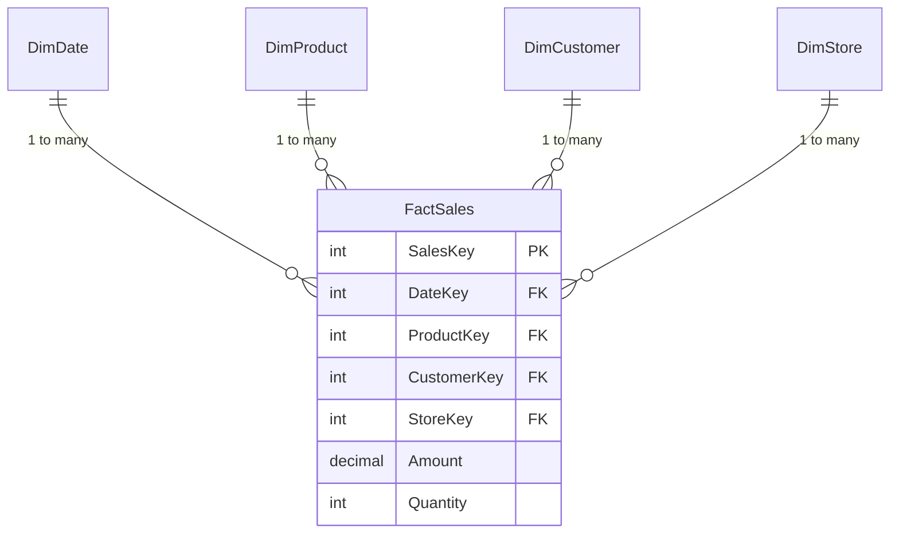
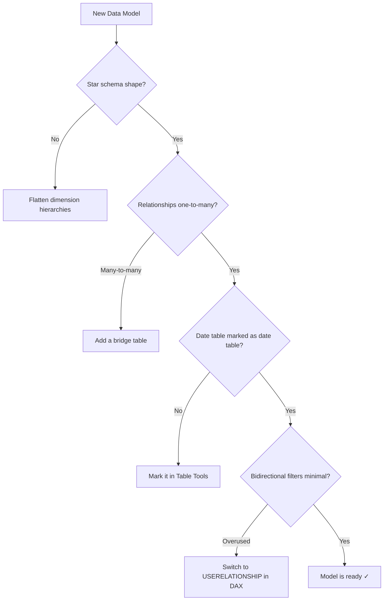

# Power BI Data Modeling Visual Edition

> Data modeling for Power BI — star schemas, relationships, and cardinality finally make sense.

Every concept follows the same three-layer format:
1. **ELI5 analogy** — a plain-English hook before any jargon
2. **Mermaid diagram** — the model structure at a glance
3. **Real-world example** — a concrete scenario with a before/after

---

## The Golden Rule of Power BI Modeling

One fact table. Many dimension tables. Filters flow from dimensions into facts. That's a star schema — and it's the foundation of everything fast in Power BI.

---

## Concepts by Tier

### Tier 1 — Foundation
| Concept | One-liner |
|---------|-----------|
| [Star Schema](concepts/star-schema.md) | One fact table surrounded by dimension tables — the Power BI sweet spot |
| [Fact vs Dimension Tables](concepts/fact-vs-dimension.md) | Numbers you measure vs things you filter by |
| [Relationships](concepts/relationships.md) | How Power BI knows which tables talk to each other |
| [Cardinality](concepts/cardinality.md) | One-to-many, many-to-many — and why it matters |

### Tier 2 — Relationship Mechanics
| Concept | One-liner |
|---------|-----------|
| [Cross-Filter Direction](concepts/cross-filter-direction.md) | Single vs bidirectional — when filters flow both ways |
| [Active vs Inactive Relationships](concepts/active-inactive-relationships.md) | Only one relationship between two tables can be active at a time |
| [Role-Playing Dimensions](concepts/role-playing-dimensions.md) | One date table, three relationships — Order Date, Ship Date, Due Date |
| [Bridge Tables](concepts/bridge-tables.md) | The fix for many-to-many relationships |

### Tier 3 — Advanced Modeling
| Concept | One-liner |
|---------|-----------|
| [Snowflake Schema](concepts/snowflake-schema.md) | Normalized dimensions — usually a performance trap in Power BI |
| [Composite Models](concepts/composite-models.md) | Mix Import and DirectQuery tables in the same report |
| [Aggregation Tables](concepts/aggregation-tables.md) | Pre-computed summaries that Power BI hits first |
| [Calculated Tables](concepts/calculated-tables.md) | DAX-generated tables — when and why to use them |

### Tier 4 — Performance & Gotchas
| Concept | One-liner |
|---------|-----------|
| [Import vs DirectQuery](concepts/import-vs-directquery.md) | Copy data in vs query live — the tradeoff that defines everything |
| [Column Cardinality](concepts/column-cardinality.md) | High-cardinality columns kill compression — here's how to fix it |
| [Bidirectional Relationship Traps](concepts/bidirectional-traps.md) | Why bidirectional feels right but usually isn't |
| [Date Table Requirements](concepts/date-table-requirements.md) | Why Power BI's time intelligence only works with a proper date table |
| [Query Folding](concepts/query-folding.md) | Push transformations back to the source — the biggest refresh performance lever |
| [Incremental Refresh](concepts/incremental-refresh.md) | Refresh only new data — from hours to minutes for large tables |

---

## Model Health Checklist

---

## Why this repo?

80% of Power BI performance problems start in the data model, not the DAX. Yet most tutorials skip straight to writing measures. This repo covers the foundation everyone should learn first.

**Not too simple. Not too academic. Just visual.**

---

## License

MIT
