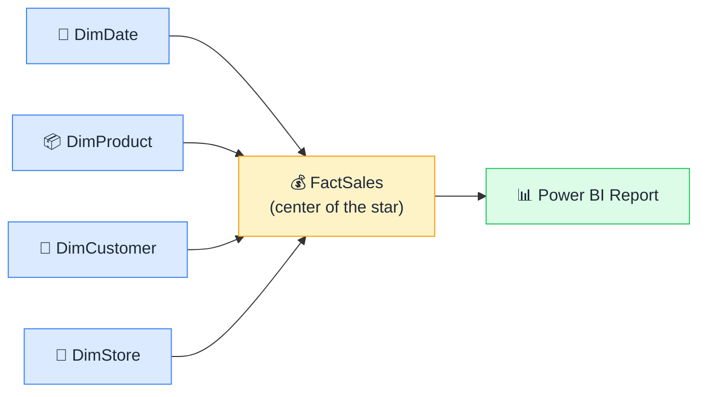

# 🗂️ Power BI Data Modeling — Visual Edition

### Build models that are fast, accurate, and impossible to break.

**Simple visuals + everyday analogies that explain Power BI data modeling to everyone — whether you're a business analyst or a data engineer new to BI.**

*If this helps you finally build a model that works — drop a ⭐. It helps more people find it.*

---

## 🤔 Why this exists

80% of Power BI performance problems start in the data model, not the DAX. Yet most tutorials skip straight to writing measures and never explain why the model needs to be a certain shape.

This repo covers the foundation first. Every concept gets:

- 🧒 **An "Explain Like I'm 5" analogy** — the one-liner you'll actually remember
- 🖼️ **A simple diagram** — see the idea, don't just read it
- 🔧 **"How it actually works"** — for when you're ready to go deeper
- 🌍 **A real-world example** — where you've already seen it in action

No data engineering degree required. Just a Power BI file and curiosity.

---

## 📚 The Concepts

### 🌱 Start here — the foundations

| # | Concept | One-liner |
|---|---------|-----------|
| 1 | [⭐ Star Schema](concepts/star-schema.md) | One fact table in the middle, dimension tables around it — the shape that makes Power BI fast. |
| 2 | [📊 Fact vs Dimension Tables](concepts/fact-vs-dimension.md) | Fact tables hold numbers and events. Dimension tables hold the context that makes those numbers meaningful. |
| 3 | [🔗 Relationships](concepts/relationships.md) | The invisible bridge that lets filters in one table cross over to another. |
| 4 | [🔢 Cardinality](concepts/cardinality.md) | How many matching rows exist on each side of a relationship — one-to-many, one-to-one, or many-to-many. |

### 🔗 Relationship mechanics

| # | Concept | One-liner |
|---|---------|-----------|
| 5 | [↔️ Cross-Filter Direction](concepts/cross-filter-direction.md) | Single = filters flow one way. Both = filters flow both ways. Both sounds better but usually causes problems. |
| 6 | [🔌 Active vs Inactive Relationships](concepts/active-inactive-relationships.md) | Only one relationship between two tables can be active — the rest sit on standby until called. |
| 7 | [🎭 Role-Playing Dimensions](concepts/role-playing-dimensions.md) | One date table playing three characters: Order Date, Ship Date, and Due Date. |
| 8 | [🌉 Bridge Tables](concepts/bridge-tables.md) | A helper table that resolves many-to-many relationships without breaking your model. |

### 🏗️ Advanced modeling

| # | Concept | One-liner |
|---|---------|-----------|
| 9 | [❄️ Snowflake Schema](concepts/snowflake-schema.md) | A star schema where dimension tables branch further into sub-dimensions — usually a trap in Power BI. |
| 10 | [🧩 Composite Models](concepts/composite-models.md) | Mix Import tables and DirectQuery tables in the same report model. |
| 11 | [📋 Aggregation Tables](concepts/aggregation-tables.md) | Pre-computed summary tables Power BI hits first — detail tables only if the summary doesn't cover it. |
| 12 | [🧮 Calculated Tables](concepts/calculated-tables.md) | Tables you build entirely in DAX — exist only in the model, no source data required. |

### ⚡ Performance & gotchas

| # | Concept | One-liner |
|---|---------|-----------|
| 13 | [📥 Import vs DirectQuery](concepts/import-vs-directquery.md) | Import copies data into Power BI at refresh time. DirectQuery asks the source every time a visual loads. |
| 14 | [📏 Column Cardinality](concepts/column-cardinality.md) | Columns with millions of unique values compress poorly — and slow down every report that uses them. |
| 15 | [⚠️ Bidirectional Relationship Traps](concepts/bidirectional-traps.md) | Bidirectional filtering feels powerful until it creates ambiguous filter paths and wrong results. |
| 16 | [📅 Date Table Requirements](concepts/date-table-requirements.md) | Time intelligence functions only work if your date table meets four specific requirements. |
| 17 | [🪗 Query Folding](concepts/query-folding.md) | Power Query pushes your transformation steps back to the database — so it only downloads the rows you need. |
| 18 | [🔄 Incremental Refresh](concepts/incremental-refresh.md) | Refresh only the new rows — historical data stays untouched. |

---

## 🗺️ How it all fits together

> **Read it in order** if you're starting from scratch — each concept builds on the last.
> **Jump around** if you already know the basics and want to fix a specific problem.

---

## 🚀 Quick Start

1. Pick a concept from the [table above](#-the-concepts).
2. Read the analogy. Look at the diagram.
3. Curious? Read "How it actually works."
4. Found it useful? **Star the repo** ⭐ and share it.

---

## 🤝 Contributing

Know a concept we're missing? Have a better analogy? **We'd love your help.**

See [CONTRIBUTING.md](CONTRIBUTING.md) for the simple template — adding a concept takes about 10 minutes.

Good first additions: *Row-Level Security (RLS), Object-Level Security, Power Query M basics, Dataflows, Field Parameters, Calculation Groups, Many-to-many patterns.*

---

## 🔗 Sister Projects

- [DAX Visual](https://github.com/behnia137/dax-visual) — DAX concepts explained with the same visual-first approach
- [AI for Beginners — Visual Edition](https://github.com/behnia137/ai-for-beginners-visual) — AI concepts with simple diagrams and everyday analogies

---

## 📜 License

[MIT](LICENSE) — free to use, share, remix, and teach with. Attribution appreciated.

---

**Made for people who build things in Power BI.** 🗂️

If this made your model click for you, the best thank-you is a ⭐.

