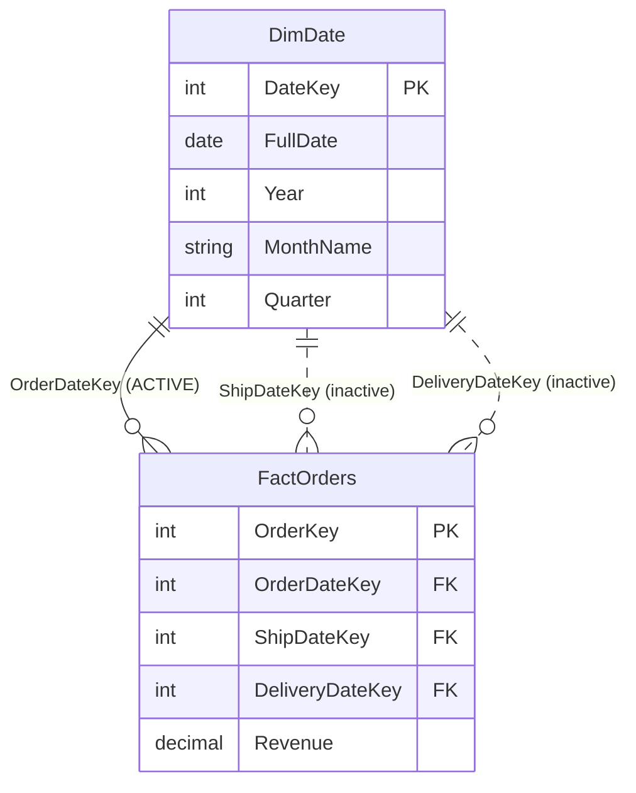

# Active vs Inactive Relationships

## ELI5

A fact table for sales orders has three dates: the order date, the ship date, and the delivery date. You want all three connected to your date dimension so you can slice by any of them. But Power BI only lets one relationship be "live" at a time — otherwise it would not know which date to use when you drop a month slicer on the canvas.

The relationship you use most (usually order date) becomes the **active** relationship — it fires automatically for every visual. The other two become **inactive** relationships — they sit in the background, available whenever you specifically call on them in a DAX measure.

## Visual



> Solid lines = active relationship. Dashed lines = inactive relationship.

## How it works in practice

The model has one active relationship on `OrderDateKey`. Two DAX measures activate the inactive ones on demand:

```dax
-- Uses the active relationship automatically
Sales by Order Date = SUM(FactOrders[Revenue])

-- Activates the inactive ShipDateKey relationship
Sales by Ship Date =
CALCULATE(
    SUM(FactOrders[Revenue]),
    USERELATIONSHIP(FactOrders[ShipDateKey], DimDate[DateKey])
)

-- Activates the inactive DeliveryDateKey relationship
Sales by Delivery Date =
CALCULATE(
    SUM(FactOrders[Revenue]),
    USERELATIONSHIP(FactOrders[DeliveryDateKey], DimDate[DateKey])
)
```

A report can then place all three measures side-by-side in a table visual, each correctly filtered by the same date slicer but through its respective relationship.

### Key facts

- [ ] Only **one relationship** between any two tables can be active at a time
- [ ] Inactive relationships are created by Power BI automatically when you try to add a second relationship between the same two tables
- [ ] `USERELATIONSHIP()` can only be used inside a `CALCULATE()` call
- [ ] `USERELATIONSHIP()` **temporarily deactivates** the active relationship for that calculation context
- [ ] Inactive relationships do not appear in the relationship view with a solid line — they appear dashed
- [ ] This pattern is the standard solution for **role-playing dimensions** (one dimension used in multiple roles)
- [ ] Always name your FK columns clearly (`OrderDateKey`, `ShipDateKey`) so the intent is obvious in DAX
