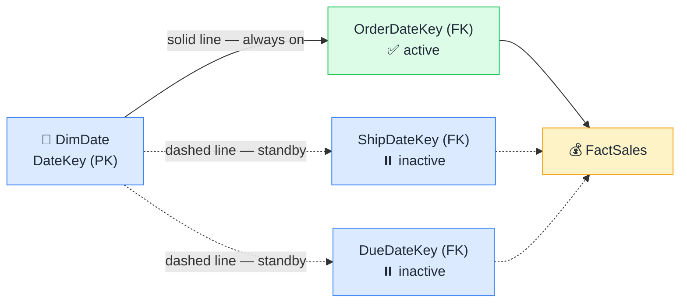

# 🔌 Active vs Inactive Relationships

> **🧒 Explain Like I'm 5:** Only one relationship between two tables can be active — the rest sit on standby until called.

## 🖼️ The Picture

The solid line carries all filters by default. Dashed lines activate only when you call them in DAX.

## 🔧 How it actually works

Power BI only allows **one active relationship** between any two tables. If you have a fact table with three date columns — OrderDate, ShipDate, DueDate — and one date dimension table, you can create three relationships, but only one can be active at a time. The active relationship is the one that carries filters automatically whenever a date slicer or date column is used in a report.

The other two relationships sit in standby — they exist in the model, they're valid, but Power BI ignores them unless explicitly told otherwise. Think of your phone's default browser: Chrome handles all links automatically. Firefox is installed and ready, but it won't open anything unless you specifically choose it.

To use an inactive relationship in a DAX measure, you wrap it in `USERELATIONSHIP()`. For example, `CALCULATE([Total Sales], USERELATIONSHIP(FactSales[ShipDateKey], DimDate[DateKey]))` tells Power BI: "for this calculation only, use the ShipDate relationship instead of the active OrderDate one." Outside of that measure, the active relationship stays in charge everywhere else. This pattern is central to [role-playing dimensions](role-playing-dimensions.md).

## 🌍 Real-world example

A logistics dashboard needs two date-based visuals: "Sales by Order Date" (uses the active relationship) and "Sales by Ship Date" (uses a measure with `USERELATIONSHIP`). Both visuals can coexist on the same page, each using a different relationship to the same date table — no duplicate tables required.

## 🔗 Related

- [Role-Playing Dimensions](role-playing-dimensions.md)
- [Relationships](relationships.md)
- [Cross-Filter Direction](cross-filter-direction.md)
