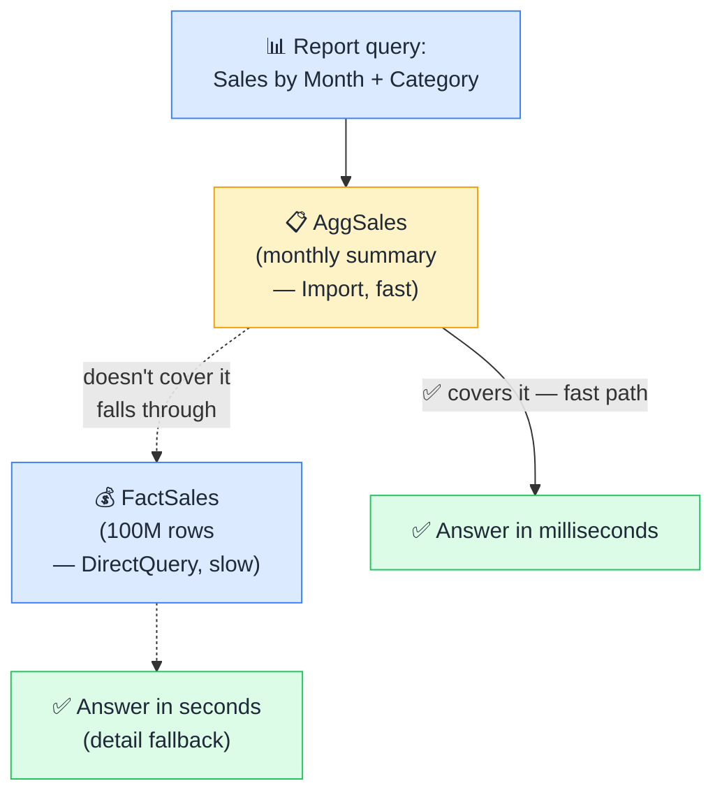

# 📋 Aggregation Tables

> **🧒 Explain Like I'm 5:** Pre-computed summary tables Power BI hits first — detail tables only if the summary doesn't cover it.

## 🖼️ The Picture

Power BI automatically routes each query to the fastest table that can answer it.

## 🔧 How it actually works

An **aggregation table** is a pre-summarized version of a large fact table. Instead of storing 100 million individual transaction rows, you pre-aggregate them by month, product category, and store — producing maybe 50,000 rows. You store this smaller table in Import mode, map it to the detail table using Power BI's aggregations feature, and Power BI will automatically use the aggregate whenever a query can be satisfied at that level of detail.

The library analogy: a library keeps a "most popular books" shelf right by the door. If the book you want is there, you grab it in seconds. If it's not on that shelf, a librarian goes to find it in the stacks. The full catalog is still there, and you always get the right book — but most visitors never need to wait for the full search.

The key phrase is "automatically routes." You define the aggregation table and the column mappings once, and Power BI decides which table to use at query time — no DAX changes needed, no separate measures for aggregated vs detail. A chart summarizing sales by quarter hits the aggregate. A drillthrough to individual transactions hits the fact table. Both work from the same model without any special handling from the report author.

## 🌍 Real-world example

An enterprise sales report with 5 years of daily transaction data (roughly 500M rows in DirectQuery) was taking 8 seconds per visual. After adding an aggregation table summarizing sales by week, product group, and region (about 200K rows in Import), the same report loaded in under a second for 90% of queries. The remaining 10% — detailed transaction drillthrough — still used the live source and took 3–4 seconds. A significant improvement with no changes to the report itself.

## 🔗 Related

- [Composite Models](composite-models.md)
- [Import vs DirectQuery](import-vs-directquery.md)
- [Calculated Tables](calculated-tables.md)
