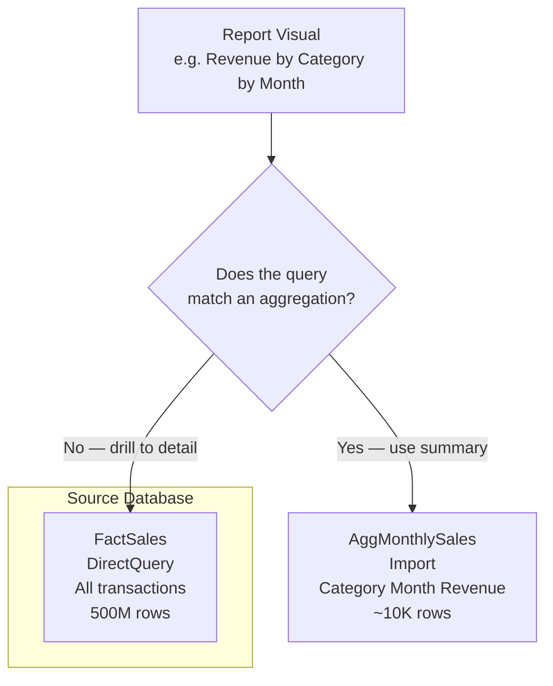

# Aggregation Tables

## ELI5

Imagine a library with a billion books. Finding a specific book takes a long time. But the librarian keeps a **summary sheet** on the front desk: "Fiction: 300 million books, Non-fiction: 400 million books, Reference: 300 million books." When you ask "how many non-fiction books are there?" the librarian answers instantly from the sheet without searching the stacks.

An aggregation table is that summary sheet. It stores pre-rolled-up versions of your fact data. Power BI checks the aggregation table first. If the question is general enough to be answered by the summary, it uses that. Only for very specific questions does it go to the full detail table.

## Visual



## How it works in practice

A model has `FactSales` in DirectQuery mode with 500 million rows. Reports showing year-over-year revenue by category are slow because every render fires a large SQL query.

The solution is to create an aggregation table:

```dax
-- Calculated table (or load from Power Query)
AggMonthlySales =
SUMMARIZECOLUMNS(
    DimDate[Year],
    DimDate[MonthNumber],
    DimProduct[Category],
    "Revenue", SUM(FactSales[Revenue]),
    "Quantity", SUM(FactSales[Quantity])
)
```

Then configure the aggregation in Power BI Desktop:
1. Right-click `AggMonthlySales` → **Manage aggregations**
2. Map `Revenue` → `SUM` of `FactSales[Revenue]`
3. Map `Year` → `GroupBy` of `DimDate[Year]`
4. Map `MonthNumber` → `GroupBy` of `DimDate[MonthNumber]`
5. Map `Category` → `GroupBy` of `DimProduct[Category]`

Now when a visual requests revenue grouped by category and month, Power BI routes the query to `AggMonthlySales` (in-memory, milliseconds). If a user drills down to individual order level, it falls through to `FactSales` (DirectQuery).

### Key facts

- [ ] Aggregation tables must be in **Import** mode to benefit from in-memory speed
- [ ] The fact table they cover should be in **DirectQuery** mode (the whole point is avoiding it)
- [ ] Hide the aggregation table from the report field list — it should be invisible to report authors
- [ ] Aggregations only fire when the query granularity is at or **above** the aggregation level — finer grain always falls through
- [ ] Use `SUMMARIZECOLUMNS` in Power Query or a calculated table to build the aggregation
- [ ] Aggregation tables are a key technique in **composite models**
- [ ] Refresh the aggregation table on a schedule — it does not automatically stay in sync with the DirectQuery source
