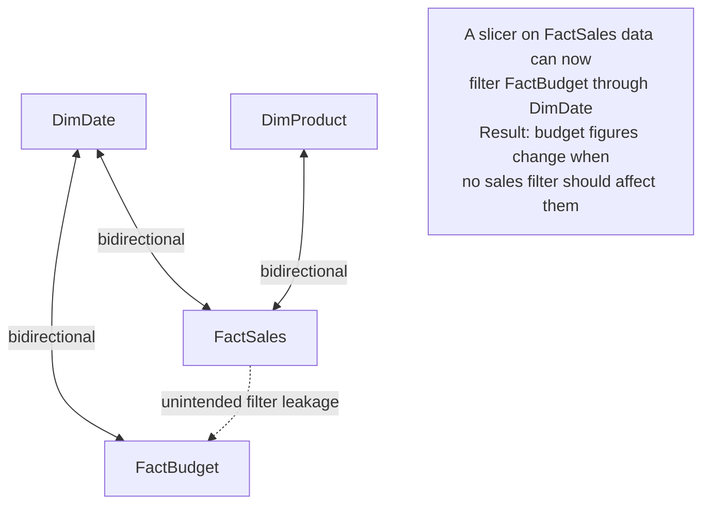

# Bidirectional Traps

## ELI5

Imagine a network of one-way streets. Filters in a star schema are like cars that can only travel in one direction — from dimension tables into the fact table. Everything is orderly and predictable.

Now imagine someone converts all the streets to two-way traffic. Cars (filters) can now go anywhere. But when there are multiple paths between two points, a GPS (Power BI) has to guess which route to take — and sometimes it picks the wrong one, or the two paths create a loop that ties up traffic forever.

Bidirectional relationships are those two-way streets. Individually they can be useful. In a complex model with multiple fact tables, they create ambiguous filter paths and silently wrong numbers.

## Visual



## How it works in practice

**Trap 1 — Filter leakage between fact tables:**

Model has `DimDate` connected bidirectionally to both `FactSales` and `FactBudget`. A user applies a product category filter. The filter flows: `DimProduct` → (bidirectional) → `FactSales` → (bidirectional via `DimDate`) → `FactBudget`. Budget figures are now filtered by product category through an unintended two-hop path.

**Trap 2 — Ambiguous filter paths (circular dependency warning):**

```
DimProduct <--> FactSales <--> DimDate <--> FactBudget <--> DimProduct
```
Power BI detects multiple filter paths between the same tables and may raise an "ambiguous paths" error, or silently choose one path — either way, results are unpredictable.

**Trap 3 — DISTINCTCOUNT inflation:**

```dax
-- Intended: count distinct products that have sales
Products Sold = DISTINCTCOUNT(FactSales[ProductKey])
```
With bidirectional filtering between `DimProduct` and `FactSales`, a filter on `DimProduct` that came from another table might expand the set of rows in `FactSales` unexpectedly, inflating the distinct count.

**Safe use of bidirectionality:**

```dax
-- Better: use CROSSFILTER in a measure instead of always-on bidirectional
Active Customers =
CALCULATE(
    DISTINCTCOUNT(DimCustomer[CustomerKey]),
    CROSSFILTER(DimCustomer[CustomerKey], FactSales[CustomerKey], BOTH)
)
```

### Key facts

- [ ] **Never enable bidirectional on a shared dimension** — a dimension used by two or more fact tables
- [ ] The Power BI "ambiguous relationships" warning is a sign of a bidirectional trap — do not ignore it
- [ ] Use `CROSSFILTER()` inside `CALCULATE()` instead of always-on bidirectional to limit the effect to specific measures
- [ ] Bidirectional is generally safe only when a dimension connects to **exactly one** fact table and no other chain exists
- [ ] Test bidirectional relationships by verifying every measure on every report page — bugs are often subtle and page-specific
- [ ] Row-level security (RLS) with bidirectional filtering has additional implications — test RLS scenarios explicitly
- [ ] If you inherit a model with widespread bidirectional relationships, use **DAX Studio** to trace filter paths before making changes
