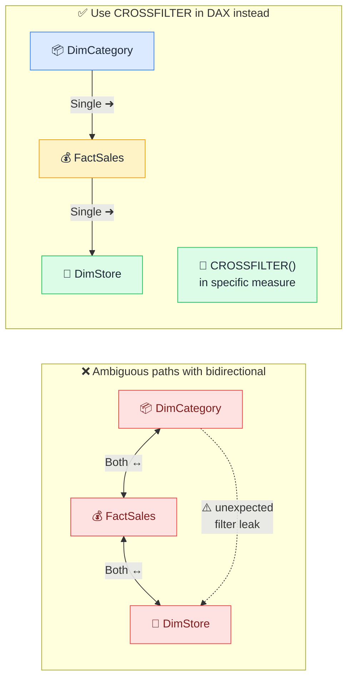

# ⚠️ Bidirectional Relationship Traps

> **🧒 Explain Like I'm 5:** Bidirectional filtering feels powerful until it creates ambiguous filter paths and wrong results.

## 🖼️ The Picture

Filters bleed through multiple bidirectional relationships into tables they were never meant to reach.

## 🔧 How it actually works

Every relationship in Power BI has a direction: filters flow from the "one" side (dimension) into the "many" side (fact). This is predictable and safe. Bidirectional relationships allow filters to travel both ways — which sounds helpful until you have more than two tables in play.

The traffic analogy: turning a few one-way streets bidirectional sounds like an upgrade — more flexibility, fewer U-turns. But in a dense city grid where every street goes both ways, two cars can arrive at the same intersection from opposite directions at the same time. Nobody knows who has right of way. In your model, "two cars arriving at the same intersection" means Power BI has found two valid filter paths to the same table and has to pick one. It may pick the wrong one, silently. Your chart now shows subtly incorrect numbers with no error message.

The safe alternative: leave all relationships set to **Single**, and use the `CROSSFILTER()` function inside specific DAX measures that genuinely need reverse filtering. This scopes the bidirectional behavior to exactly one measure, in exactly one calculation, while the rest of the model stays predictable. You get the capability without the side effects. The [cross-filter direction](cross-filter-direction.md) article covers the mechanics; this article is about why those mechanics matter at scale.

## 🌍 Real-world example

A model with bidirectional filtering on every relationship was producing a "% of Total" measure that summed to 112% across all categories. The extra 12% came from double-counting caused by ambiguous filter propagation — a filter was traveling an unintended path and including rows it shouldn't. Switching all relationships to Single and rewriting two measures with `CROSSFILTER()` fixed it.

## 🔗 Related

- [Cross-Filter Direction](cross-filter-direction.md)
- [Bridge Tables](bridge-tables.md)
- [Relationships](relationships.md)
