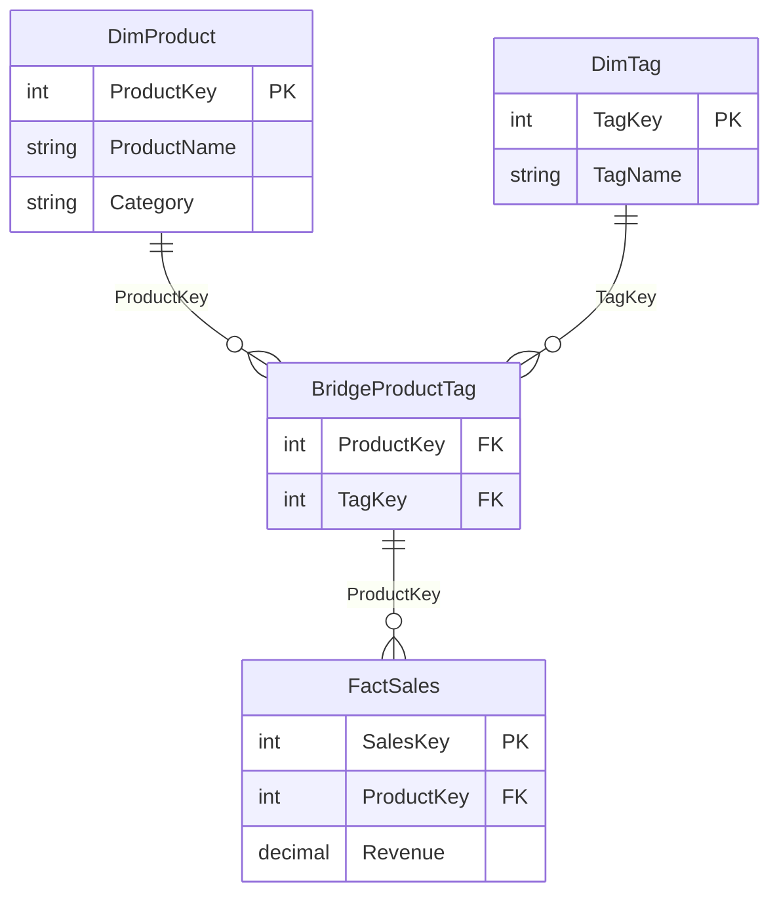

# Bridge Tables

## ELI5

Imagine a student can enroll in many courses, and a course can have many students. You cannot draw a direct line between the students list and the courses list without it becoming a tangled mess — that is a many-to-many relationship.

The fix is simple: create a third table, the **enrollment table**, that just records pairs — "Student A is in Course X," "Student A is in Course Y," "Student B is in Course X." That enrollment table is the **bridge table**. It breaks the many-to-many into two clean one-to-many relationships.

## Visual

> A product can have many tags; a tag can apply to many products. `BridgeProductTag` resolves the many-to-many cleanly.

## How it works in practice

A retail model needs to tag products with multiple labels (e.g., "Seasonal," "Clearance," "New Arrival"). One product may carry several tags. Reports need to filter sales by tag.

**Without a bridge table:** You would need to enable many-to-many cardinality between `DimTag` and `DimProduct`. This works but is harder to control, especially when `DimProduct` connects to multiple fact tables.

**With a bridge table:**

1. `DimTag` has one row per tag
2. `BridgeProductTag` has one row per product-tag combination
3. `DimProduct` joins to `BridgeProductTag` (1:many)
4. `DimTag` joins to `BridgeProductTag` (1:many)
5. `BridgeProductTag` joins to `FactSales` via `ProductKey`

Filter propagation path: `DimTag` → `BridgeProductTag` → `FactSales` — clean and predictable.

### Key facts

- [ ] A bridge table contains **only foreign keys** — no measures, no descriptive attributes
- [ ] Each row in the bridge represents a **single valid pairing** of the two joined entities
- [ ] Both relationships from the bridge table to its parent dimensions should be **Many-to-One** (bridge is the "many" side)
- [ ] The bridge table does **not** need to be visible in the report field list — hide it from report view
- [ ] Watch out for **fan-out**: if the bridge multiplies rows when a filter is applied, measures may double-count — use `DISTINCTCOUNT` not `COUNT` for such measures
- [ ] If the bridge connects to the fact table, ensure the join key is consistent (e.g., both use `ProductKey`) or the filter chain breaks
- [ ] Bridge tables are the correct, explicit alternative to relying on Power BI's built-in many-to-many cardinality
