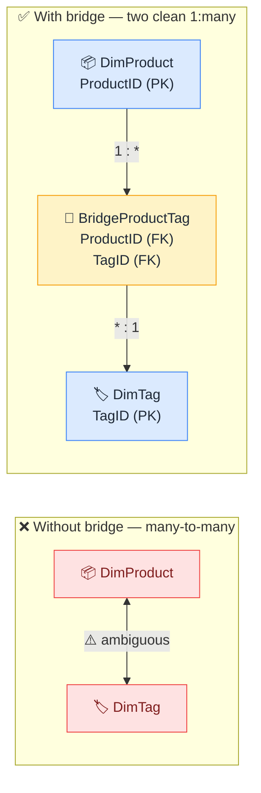

# 🌉 Bridge Tables

> **🧒 Explain Like I'm 5:** A helper table that resolves many-to-many relationships without breaking your model.

## 🖼️ The Picture

The bridge table turns one messy many-to-many into two clean one-to-many relationships.

## 🔧 How it actually works

A **bridge table** (also called a junction or associative table) sits between two entities that have a many-to-many relationship. Instead of trying to link DimProduct directly to DimTag — where one product can have many tags and one tag can apply to many products — you introduce a third table that has one row per product-tag combination. Now DimProduct has a clean 1:many relationship to the bridge, and the bridge has a clean 1:many relationship to DimTag.

The event sign-in sheet analogy: the sheet is the bridge. It has one row for every combination of "which person attended which event." The people table and the events table don't directly connect — they both connect to the sign-in sheet, and the sheet is where the two worlds meet cleanly.

In Power BI, the filter behavior of a bridge table requires some care. Filters flow from DimProduct through the bridge into DimTag, but making that work in both directions usually requires enabling bidirectional filtering on at least one of the relationships — which introduces the risks described in [cross-filter direction](cross-filter-direction.md). The cleaner approach is to keep filters single-direction and write DAX measures that explicitly navigate through the bridge when needed.

## 🌍 Real-world example

A product catalog where each product can have multiple tags ("organic," "gluten-free," "seasonal") and each tag applies to multiple products. A bridge table `BridgeProductTag` with columns `ProductID` and `TagID` resolves this cleanly. A slicer on "Tag = organic" can now correctly filter down to only the products tagged as organic, without any many-to-many ambiguity.

## 🔗 Related

- [Cardinality](cardinality.md)
- [Cross-Filter Direction](cross-filter-direction.md)
- [Bidirectional Relationship Traps](bidirectional-traps.md)
