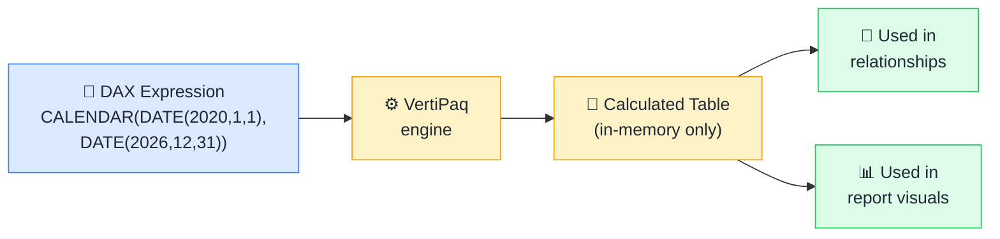

# 🧮 Calculated Tables

> **🧒 Explain Like I'm 5:** Tables you build entirely in DAX — exist only in the model, no source data required.

## 🖼️ The Picture

The table is real and fully usable — it just lives inside the model, not in any external source.

## 🔧 How it actually works

A **calculated table** is a table defined by a DAX expression. You write the expression in the Data view using "New Table," and Power BI evaluates the DAX, materializes the result into memory, and stores it as a full table inside the model. It has columns, rows, data types — everything a regular imported table has. You can create relationships to it, write measures that reference it, and use its columns in report visuals.

The whiteboard analogy: you're in a meeting and you draw a table on the whiteboard. It's completely real and everyone in the room can read it. But it only exists in that room — there's no file on a server somewhere, no database backing it. The moment you wipe the whiteboard (or reload the model), it gets recalculated fresh from the same DAX expression.

Common uses: building a date table with `CALENDAR()` or `CALENDARAUTO()` when you don't have one in your source, creating static lookup tables like a `{ "A", "B", "C" }` value list, generating disconnected slicer tables for what-if scenarios, or materializing a complex filtered subset of a larger table for performance. The important gotcha: calculated tables are recalculated on every model refresh, so they're not free — very large or very complex calculated tables can slow down refresh time.

## 🌍 Real-world example

Your data source doesn't have a dedicated date table. You write `DimDate = CALENDAR(DATE(2018,1,1), DATE(2030,12,31))` in Power BI, add calculated columns for Year, Quarter, Month, and Week, mark it as a date table, and build a relationship to your fact table. A fully functional date dimension — no source changes, no Power Query steps, just DAX.

## 🔗 Related

- [Date Table Requirements](date-table-requirements.md)
- [Aggregation Tables](aggregation-tables.md)
- [Import vs DirectQuery](import-vs-directquery.md)
