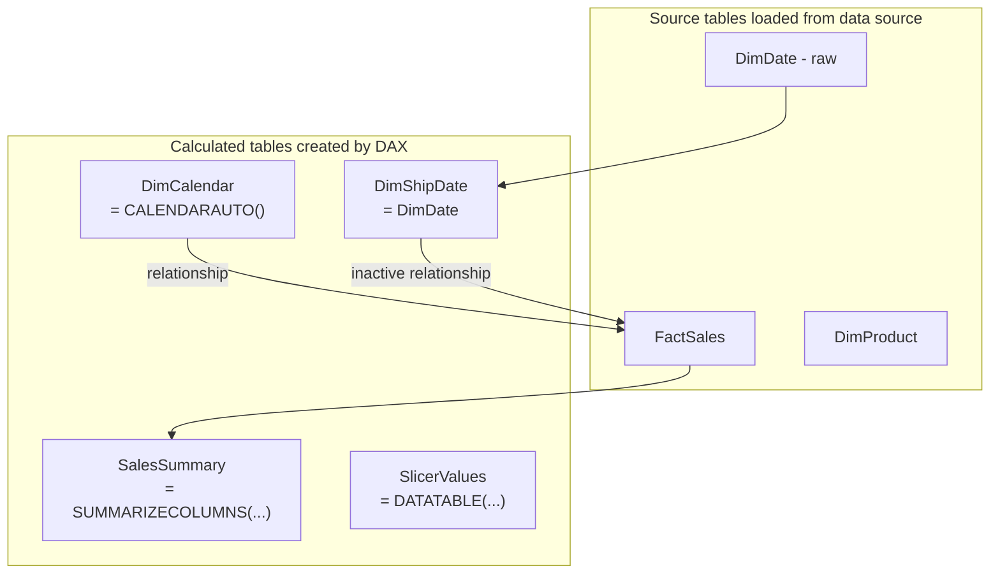

# Calculated Tables

## ELI5

Most tables in Power BI come from your data source — a database, Excel file, or API. A **calculated table** is a table you create entirely inside Power BI using a DAX formula, with no external source required.

It is like building a new spreadsheet tab inside Excel using formulas that reference other tabs. The result is a real table in your model — you can create relationships to it, write measures against it, and show columns from it in visuals.

## Visual



## How it works in practice

**Common use cases:**

**1. Date table:**
```dax
DimCalendar =
ADDCOLUMNS(
    CALENDAR(DATE(2020,1,1), DATE(2026,12,31)),
    "Year",        YEAR([Date]),
    "MonthNumber", MONTH([Date]),
    "MonthName",   FORMAT([Date], "MMMM"),
    "Quarter",     "Q" & QUARTER([Date]),
    "WeekDay",     WEEKDAY([Date], 2)
)
```

**2. Role-playing dimension copy:**
```dax
DimShipDate = DimDate
DimDeliveryDate = DimDate
```

**3. Static slicer values (disconnected slicer):**
```dax
MeasureSelector =
DATATABLE(
    "MeasureName", STRING,
    "SortOrder",   INTEGER,
    {
        {"Revenue",  1},
        {"Quantity", 2},
        {"Profit",   3}
    }
)
```

**4. Pre-aggregated summary table:**
```dax
MonthlySummary =
SUMMARIZECOLUMNS(
    DimDate[Year],
    DimDate[MonthNumber],
    DimProduct[Category],
    "Revenue", SUM(FactSales[Revenue])
)
```

### Key facts

- [ ] Calculated tables are computed at **model refresh time** and stored in VertiPaq — they are not recalculated at query time
- [ ] They count against your model's memory footprint — avoid large calculated tables if an equivalent Power Query transformation would be smaller
- [ ] Calculated tables can reference other calculated tables, but **circular dependencies** will cause a model error
- [ ] Relationships to and from calculated tables work exactly like relationships to regular tables
- [ ] `CALENDARAUTO()` generates a date table from the earliest and latest dates found in all date columns in your model — convenient but less controlled than an explicit `CALENDAR()` call
- [ ] Calculated tables created via DAX refresh with every dataset refresh — there is no separate refresh schedule
- [ ] Changes to source data are only reflected after a full model refresh — calculated tables do not update in real time
