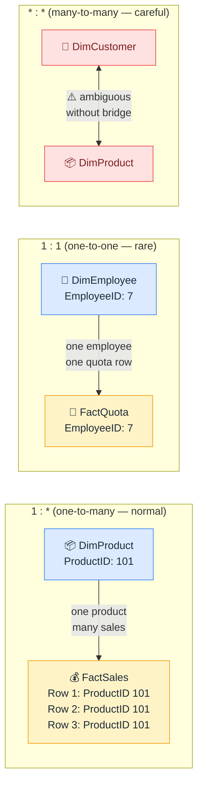

# 🔢 Cardinality

> **🧒 Explain Like I'm 5:** How many matching rows exist on each side of a relationship — one-to-many, one-to-one, or many-to-many.

## 🖼️ The Picture

One-to-many is the default and safest. Many-to-many needs special handling.

## 🔧 How it actually works

**One-to-many (1:*)** is the star schema standard. One row in the dimension table matches many rows in the fact table — one product maps to hundreds of sales. Power BI handles this cleanly and efficiently. When you define a relationship, Power BI detects and sets this cardinality automatically if the key column in your dimension table has unique values.

**One-to-one (1:1)** means each row on one side matches exactly one row on the other. This is rare and often a sign that two tables could simply be merged. It works fine in Power BI but adds a relationship without adding much — consider whether a merge in Power Query makes more sense.

**Many-to-many (\*:\*)** is where things get tricky. A customer can buy many products, and a product can be bought by many customers — but there's no clean single key connecting them. Power BI allows many-to-many relationships directly, but the filter behavior can be surprising and performance can suffer. The cleaner solution is a [bridge table](bridge-tables.md) that sits between the two and resolves the relationship through two 1:many connections.

## 🌍 Real-world example

School data: one teacher teaches many students (1:many — ideal). One student has one enrollment record (1:1 — fine). Many students join many clubs (many:many — needs a bridge table like `StudentClubMemberships` with one row per student-club combination).

## 🔗 Related

- [Relationships](relationships.md)
- [Bridge Tables](bridge-tables.md)
- [Cross-Filter Direction](cross-filter-direction.md)
