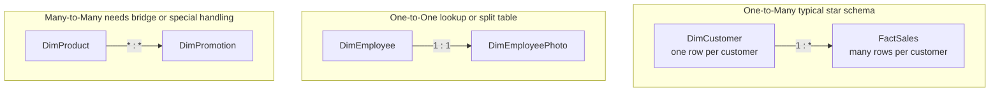

# Cardinality

## ELI5

Cardinality is just the answer to: "for every row on this side of the relationship, how many matching rows can exist on the other side?"

Think about a library. One author can write many books — that is a **one-to-many** relationship. One book has exactly one ISBN — that is **one-to-one**. A book can belong to many genres and a genre can cover many books — that is **many-to-many**.

Power BI needs to know the cardinality so it applies filters correctly and warns you when something looks wrong (like a dimension table that accidentally has duplicate keys).

## Visual

## How it works in practice

A retail model has `DimCustomer` (one row per customer) joined to `FactSales` (many rows per customer). Power BI detects the unique `CustomerKey` in `DimCustomer` and sets the cardinality to **One-to-Many (1:*)** automatically.

If a developer accidentally loads `DimCustomer` with duplicate `CustomerKey` values, Power BI either raises a relationship warning or silently switches to Many-to-Many — both produce wrong filter results.

### Cardinality types in Power BI

| Setting | Meaning | Typical use |
|---|---|---|
| One-to-Many (1:*) | One unique key joins to many rows | Dimension → Fact (default star schema) |
| Many-to-One (*:1) | Same as above, stated from the fact side | Power BI shows this when the fact table is on the left |
| One-to-One (1:1) | Both columns are unique | Split dimension tables, language variants |
| Many-to-Many (*:*) | Neither column is unique | Currency exchange rates, tag assignments — use carefully |

### Key facts

- [ ] Always verify that the "one" side column has **no duplicate values** — use `COUNTROWS` = `DISTINCTCOUNT` to check
- [ ] Many-to-many relationships in VertiPaq use an internal bridge and can cause unexpected filter behavior
- [ ] Prefer resolving many-to-many with an explicit **bridge table** rather than the built-in many-to-many setting
- [ ] One-to-one relationships are rare in a clean star schema — consider merging the tables if they always travel together
- [ ] Setting the wrong cardinality will not always produce an error — it will silently produce wrong numbers
