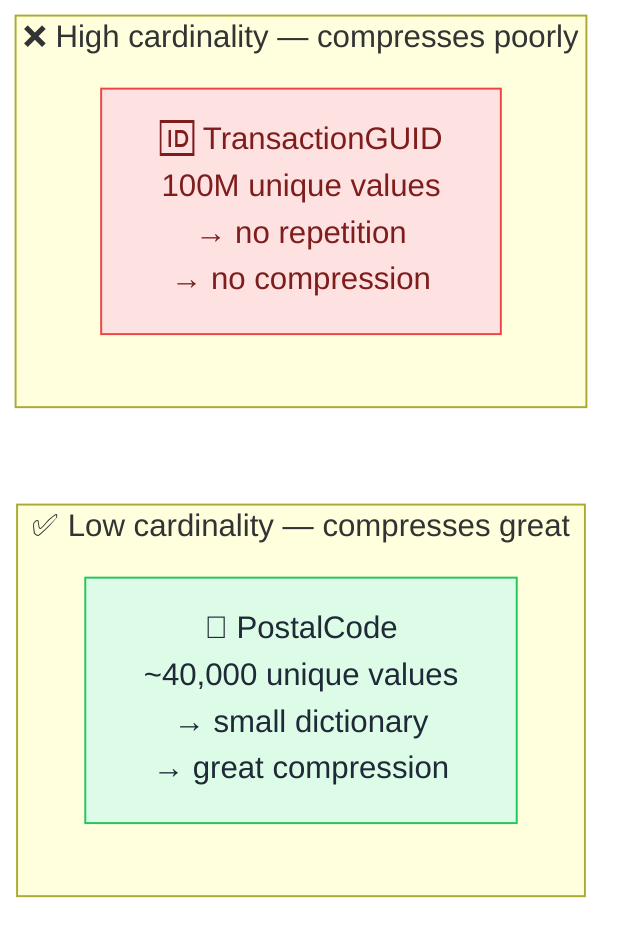

# 📏 Column Cardinality

> **🧒 Explain Like I'm 5:** Columns with millions of unique values compress poorly — and slow down every report that uses them.

## 🖼️ The Picture

Columns that repeat values compress well. Columns where every row is unique don't compress at all.

## 🔧 How it actually works

VertiPaq — Power BI's in-memory engine — stores columns using **dictionary encoding**. It builds a dictionary of unique values for each column, then stores each row as an index into that dictionary rather than the raw value. If a column has only 100 unique values across 10 million rows, VertiPaq only needs to store 100 values in the dictionary and 10 million small integers. Compression is excellent.

If a column has 10 million unique values (like a GUID, a full timestamp with milliseconds, or a free-text note), VertiPaq still stores a dictionary — but now the dictionary has 10 million entries. There's no repetition to compress. The column takes up nearly as much memory as the raw data would, and every query that touches it has to process all 10 million distinct values.

High-cardinality columns hurt in three ways: they consume more RAM, they slow down queries that filter or group by them, and they can push your dataset over the size limit for Power BI Premium capacity. The fixes are practical: remove the column if it's not needed in reports, truncate timestamps to the grain you actually report on (day instead of millisecond), or replace GUIDs with integer surrogate keys in Power Query before the data reaches the model.

## 🌍 Real-world example

A web analytics dataset included a `SessionID` column — a UUID per session, 50 million rows of them. Just that one column was consuming 1.8 GB in the model and making every query slower. Removing it (it wasn't used in any report) cut model size by 40% and reduced average query time from 4 seconds to under 1 second.

## 🔗 Related

- [Import vs DirectQuery](import-vs-directquery.md)
- [Cardinality](cardinality.md)
- [Incremental Refresh](incremental-refresh.md)
