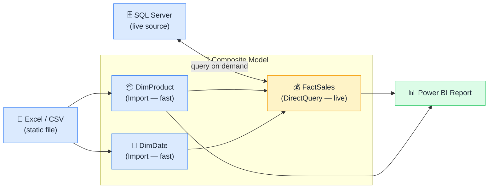

# 🧩 Composite Models

> **🧒 Explain Like I'm 5:** Mix Import tables and DirectQuery tables in the same report model.

## 🖼️ The Picture

Import tables power fast dimension filtering. DirectQuery delivers live fact data.

## 🔧 How it actually works

A **composite model** lets you combine tables in **Import mode** (data copied into Power BI's in-memory engine) with tables in **DirectQuery mode** (data queried live from the source) — all in the same semantic model. Before composite models existed, you had to choose one mode for the entire report. Now you can pick the right mode per table.

The hybrid car analogy fits: a hybrid uses its battery for short city trips (efficient, instant, quiet) and its engine for long highway runs (necessary when you need more range). Composite models work the same way — put your dimension tables in Import mode for instant filter performance, and put your large or frequently updated fact tables in DirectQuery mode so reports always show current data without waiting for a scheduled refresh.

The practical caveat: when a query involves both Import and DirectQuery tables, Power BI has to query the DirectQuery source and then join the results with the in-memory data — which takes longer than a pure Import query. For most cases this is acceptable. The real power of composite models is pairing a DirectQuery source with pre-built [aggregation tables](aggregation-tables.md) in Import mode, so most queries hit the fast aggregate and only rare detail-level queries fall through to the live source.

## 🌍 Real-world example

A real-time operations dashboard pulls transaction data from a live Azure SQL database (DirectQuery) but filters by product hierarchy and store region from a static dimension file (Import). Dimension slicers are instantaneous; the transaction charts reflect data from the last few seconds. Before composite models, you'd have to choose: accept stale Import data, or accept slow pure-DirectQuery dimension filters.

## 🔗 Related

- [Import vs DirectQuery](import-vs-directquery.md)
- [Aggregation Tables](aggregation-tables.md)
- [Star Schema](star-schema.md)
