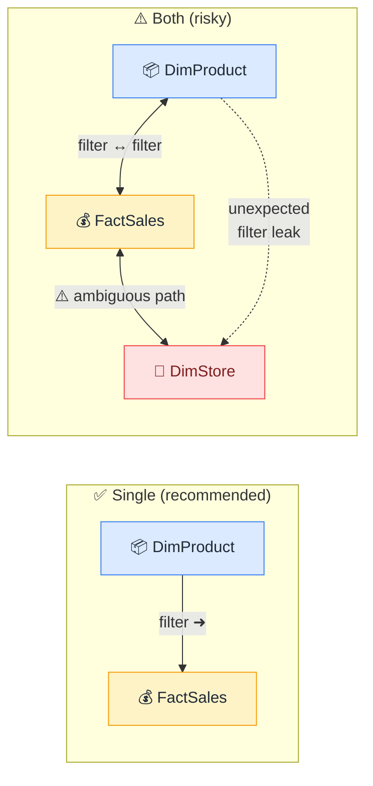

# ↔️ Cross-Filter Direction

> **🧒 Explain Like I'm 5:** Single = filters flow one way. Both = filters flow both ways. Both sounds better but usually causes problems.

## 🖼️ The Picture

Bidirectional filters can bleed sideways into tables you didn't intend to filter.

## 🔧 How it actually works

Every relationship in Power BI has a **cross-filter direction**: either **Single** or **Both**. Single means filters travel in one direction only — from the "one" side (the dimension) into the "many" side (the fact table). This is the default and almost always the right choice. Both means filters can travel in either direction, so a filter on the fact table can also filter the dimension table.

The one-way street analogy: a one-way street is predictable. Everyone knows who has priority, traffic flows smoothly, and there are no head-on collisions. A two-way street in a tight model is fine in isolation, but the moment you have three or four tables all set to bidirectional, you end up with multiple paths through the model. When two different routes lead to the same destination, Power BI has to guess which one you meant — and it doesn't always guess right.

The practical rule: keep all relationships on **Single**. If you need filtering to flow in the reverse direction for a specific DAX measure, use the `CROSSFILTER()` function instead of changing the relationship setting globally. This gives you the power of bidirectional filtering only where you explicitly ask for it, without accidentally enabling it everywhere else.

## 🌍 Real-world example

You set a relationship between DimProduct and FactSales to "Both." Now a slicer on FactSales (say, filtering to high-value transactions) also filters DimProduct — which means a separate chart showing "all products" is now showing only the products involved in high-value transactions. The filtering leaked sideways, and the chart is now wrong in a way that's hard to spot.

## 🔗 Related

- [Relationships](relationships.md)
- [Bidirectional Relationship Traps](bidirectional-traps.md)
- [Active vs Inactive Relationships](active-inactive-relationships.md)
