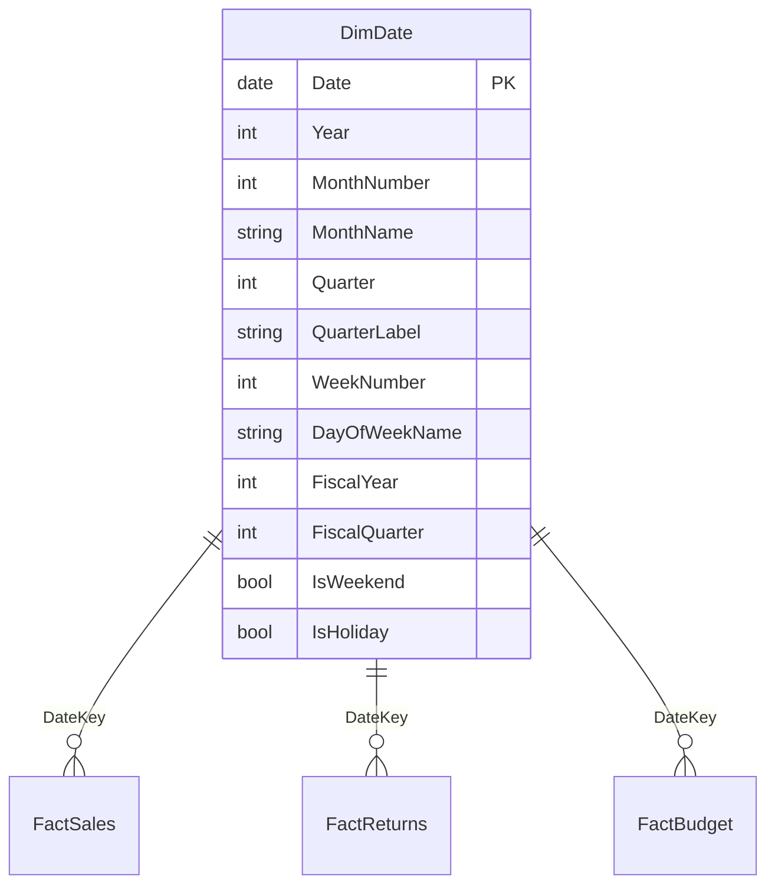

# Date Table Requirements

## ELI5

Power BI has a built-in calendar that it uses to understand phrases like "year to date," "same period last year," and "rolling 12 months." But this built-in calendar is hidden, limited, and often wrong for your business.

To use time intelligence functions (like `DATESYTD`, `SAMEPERIODLASTYEAR`, `DATEADD`) reliably, you must give Power BI an **explicit date table** — a proper dimension table with one row per day, no gaps, and a few required column types. Then you tell Power BI "this is my official date table" by marking it.

Think of it as registering your own calendar at city hall. Until you do that, the city uses its own default calendar, which may not match your fiscal year or regional holidays.

## Visual



## How it works in practice

**Minimum requirements for marking a table as a date table:**

1. Contains a column of data type **Date** (not DateTime)
2. That column has **no blank or null values**
3. That column has **no duplicate values** — one row per day
4. The date range **covers all dates** referenced in any fact table (ideally with a buffer of at least one full year on each side)

**Marking the table in Power BI Desktop:**
Right-click the table in the field list → **Mark as date table** → select the `Date` column.

**DAX date table (calculated table approach):**
```dax
DimCalendar =
VAR StartDate = DATE(2019, 1, 1)
VAR EndDate   = DATE(2026, 12, 31)
RETURN
ADDCOLUMNS(
    CALENDAR(StartDate, EndDate),
    "Year",           YEAR([Date]),
    "MonthNumber",    MONTH([Date]),
    "MonthName",      FORMAT([Date], "MMMM"),
    "MonthShort",     FORMAT([Date], "MMM"),
    "Quarter",        QUARTER([Date]),
    "QuarterLabel",   "Q" & QUARTER([Date]) & " " & YEAR([Date]),
    "DayOfWeekNum",   WEEKDAY([Date], 2),
    "DayOfWeekName",  FORMAT([Date], "dddd"),
    "IsWeekend",      WEEKDAY([Date], 2) >= 6,
    "FiscalYear",     IF(MONTH([Date]) >= 7, YEAR([Date]) + 1, YEAR([Date])),
    "FiscalQuarter",  SWITCH(TRUE(),
                          MONTH([Date]) IN {7,8,9},   1,
                          MONTH([Date]) IN {10,11,12}, 2,
                          MONTH([Date]) IN {1,2,3},   3,
                          4)
)
```

**What breaks without a properly marked date table:**
- `DATESYTD()`, `TOTALYTD()`, `SAMEPERIODLASTYEAR()` — all fail or produce incorrect results
- Power BI's auto date/time hierarchy generates hidden tables per column — creates model bloat
- Time intelligence over fiscal periods is impossible without fiscal year columns

### Key facts

- [ ] The date column must be **data type Date** — not DateTime, not text, not integer
- [ ] The date column must be **contiguous** — no missing days between the min and max date
- [ ] The date column must have **no duplicates** and **no nulls**
- [ ] The date range must **fully cover** the date range in all related fact tables — partial coverage causes blank results at the edges
- [ ] After creating the table, explicitly **Mark as date table** in Power BI Desktop — without this, time intelligence functions may still fail
- [ ] Disable the **Auto date/time** setting in Power BI Desktop options (File → Options → Data Load) to prevent Power BI from generating hidden date tables for every date column
- [ ] Add **fiscal year and quarter columns** if your business does not follow the calendar year — these cannot be derived by built-in functions
- [ ] One date table can serve multiple fact tables — each fact table gets its own relationship to `DimDate` using the appropriate date key
