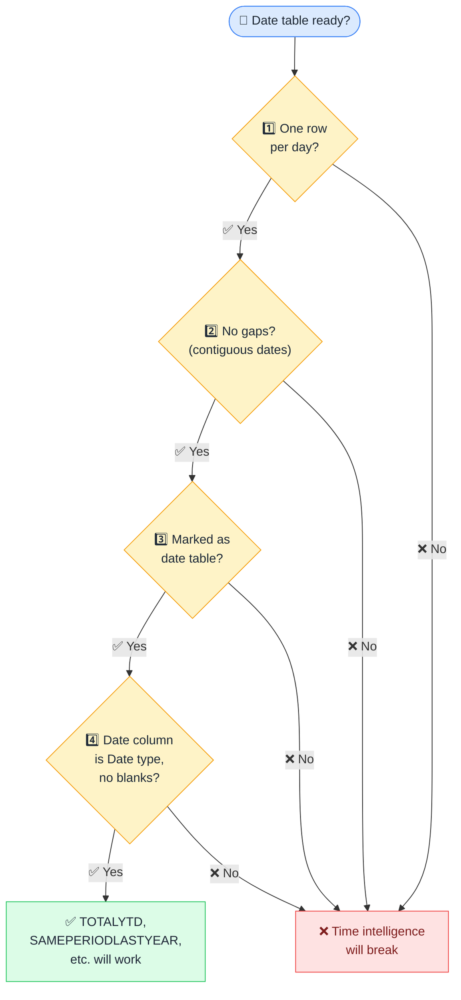

# 📅 Date Table Requirements

> **🧒 Explain Like I'm 5:** Time intelligence functions only work if your date table meets four specific requirements.

## 🖼️ The Picture

All four requirements must be met. Miss one and time intelligence functions return wrong results or errors.

## 🔧 How it actually works

DAX time intelligence functions — `TOTALYTD`, `SAMEPERIODLASTYEAR`, `DATEADD`, `PREVIOUSMONTH`, and others — are conveniences that do complex date math on your behalf. But they only work correctly if they can trust the structure of your date table. Power BI enforces four rules before it considers a date table trustworthy enough for time intelligence.

**Rule 1: One row per calendar day.** Every date in the range must appear exactly once. No duplicate dates, no missing dates between your start and end. **Rule 2: Contiguous range.** If your data spans January 2020 to December 2025, your date table must have a row for every single day in that range — even days with no transactions. A gap (say, the dates around a system outage) breaks date math that crosses the gap. **Rule 3: Marked as date table.** In the Table tools ribbon, you must explicitly click "Mark as date table" and specify which column is the date column. This tells Power BI to use your table for time intelligence instead of auto-generating its own internal calendar. **Rule 4: The date column must be of the Date data type with no blank values.** If there are null dates in the column, the marking step will refuse to complete.

The city hall analogy: a city hall only stamps documents if you bring the right paperwork, properly filled out, with no missing fields. No exceptions, no workarounds, no partial approvals. Your date table is the paperwork.

## 🌍 Real-world example

A report using `TOTALYTD([Revenue], DimDate[Date])` was returning blank for certain months. Investigation revealed the date table was generated from the fact table using `DISTINCT(FactSales[OrderDate])` — which meant it only had rows for dates that had sales. Weekends and holidays with no orders were missing, breaking the contiguous requirement. Replacing it with `CALENDAR(DATE(2020,1,1), DATE(2026,12,31))` fixed all the blanks.

## 🔗 Related

- [Calculated Tables](calculated-tables.md)
- [Role-Playing Dimensions](role-playing-dimensions.md)
- [Active vs Inactive Relationships](active-inactive-relationships.md)
