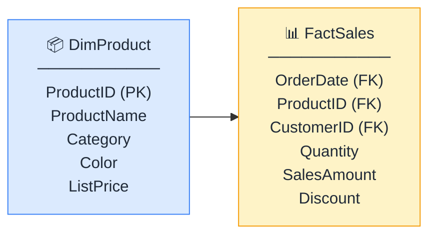

# 📊 Fact vs Dimension Tables

> **🧒 Explain Like I'm 5:** Fact tables hold numbers and events. Dimension tables hold the context that makes those numbers meaningful.

## 🖼️ The Picture

The fact table is mostly numbers and foreign keys. The dimension table is mostly descriptions.

## 🔧 How it actually works

A **fact table** records things that happened — a sale, a web session, a support ticket. Its rows are events, and its columns are either **measures** (the numbers you'll aggregate: quantity, amount, duration) or **foreign keys** (the IDs that point to dimension tables). Fact tables tend to be tall and narrow: millions of rows, but relatively few columns.

A **dimension table** describes the people, places, and things involved in those events. Its rows are entities — a product, a customer, a store — and its columns are attributes you'd use to slice and filter: category, city, store size. Dimension tables are typically short and wide: fewer rows, but many descriptive columns. The primary key in a dimension table is the same ID that appears as a foreign key in the fact table.

The receipt analogy works well here. The receipt itself (fact) tells you that three large pepperonis were ordered at 7:15 pm for $32.50. The customer record (dimension) tells you the customer's name, loyalty tier, and city. The product record (dimension) tells you the category, size options, and allergens. Neither the receipt nor the records are useful alone — together they answer real questions.

## 🌍 Real-world example

In a retail model, `FactSales` has one row per transaction line. `DimCustomer` has one row per customer. When a report asks "what's total revenue by customer region?", Power BI filters `DimCustomer` on the region column, follows the relationship into `FactSales`, and sums `SalesAmount` for only the matching rows.

## 🔗 Related

- [Star Schema](star-schema.md)
- [Relationships](relationships.md)
- [Cardinality](cardinality.md)
