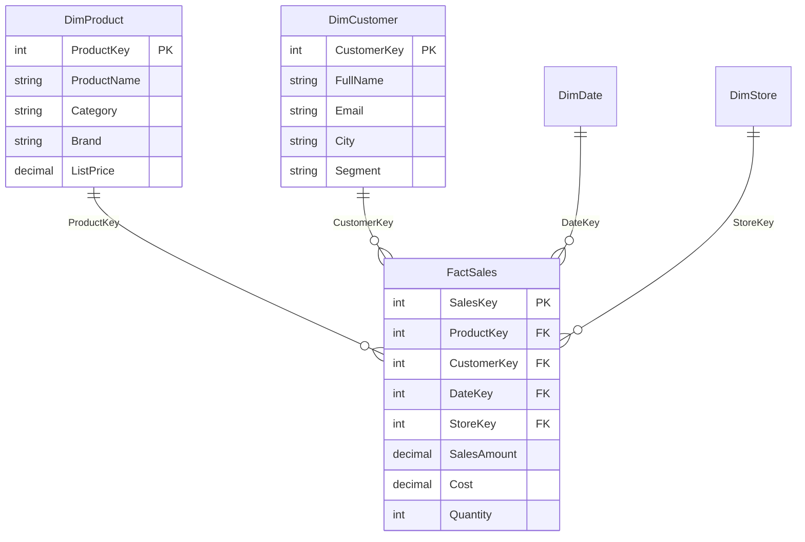

# Fact vs Dimension Tables

## ELI5

Think of a receipt from the grocery store. The line items — 2 apples, 1 loaf of bread, $14.73 total — are the **facts**. They are numbers that happened at a specific moment and cannot be changed after the fact.

Now think of all the label information around those numbers: the store's name and address, the product's brand and category, the cashier's name, today's date. That is the **dimension** data — it describes *who, what, where, and when* around the facts.

Fact tables are tall and skinny (millions of rows, mostly numbers). Dimension tables are short and wide (thousands of rows, mostly text).

## Visual

## How it works in practice

A sales analyst builds a report showing revenue by product category over time. The `SalesAmount` and `Quantity` columns come from `FactSales`. The `Category` label in the visual axis comes from `DimProduct`. The month name on the X-axis comes from `DimDate`. The fact table never stores any of those labels — it only stores the foreign keys that point to them.

### Key facts

- [ ] Fact tables hold **measurable events** — sales, clicks, payments, log entries
- [ ] Dimension tables hold **descriptive attributes** — names, categories, addresses, codes
- [ ] Fact table rows should be **additive** — it makes sense to SUM or COUNT them
- [ ] Dimension tables must have a **unique primary key** column with no nulls or duplicates
- [ ] Never put descriptive text (product name, customer city) directly in the fact table — it inflates row size and defeats VertiPaq compression
- [ ] A column in a fact table that is not a measure and not a foreign key is a design smell — move it to a dimension
