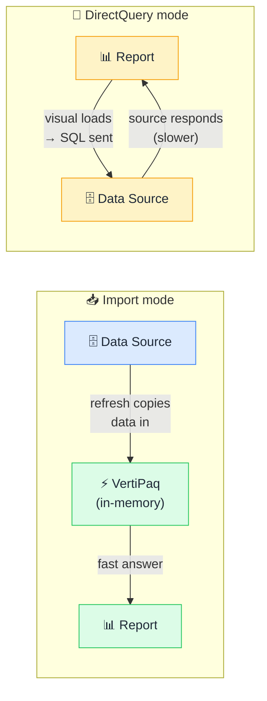

# 📥 Import vs DirectQuery

> **🧒 Explain Like I'm 5:** Import copies data into Power BI at refresh time. DirectQuery asks the source every time a visual loads.

## 🖼️ The Picture

Import is fast because the data lives in memory. DirectQuery is live because it never caches.

## 🔧 How it actually works

**Import mode** copies data from your source into Power BI's VertiPaq engine — a highly compressed, column-oriented, in-memory store. Queries run against this in-memory copy, which is why Import reports are so fast. The tradeoff: the data is only as fresh as your last scheduled refresh (hourly at best on standard Premium capacity). The dataset also has to fit in available memory.

**DirectQuery mode** sends a SQL (or equivalent) query to your source every time a visual needs to render. The data is always current — seconds-fresh — because it's never cached. The tradeoff: every click, every slicer change, every page load generates a round-trip to the database. Performance depends entirely on the source system. A slow or heavily loaded database means a slow report, and there's nothing you can do about it on the Power BI side.

The printout analogy captures it well: Import is printing a document and working from the printout — fast to read, doesn't reflect changes made after printing. DirectQuery is opening the live original file every time you want to read it — always current, but you're at the mercy of the server's availability and speed. The right choice depends on how fresh your data needs to be and how large your dataset is. For most reporting scenarios, Import wins. For real-time operational dashboards or datasets too large to fit in memory, DirectQuery (or a [composite model](composite-models.md)) is the answer.

## 🌍 Real-world example

A financial reporting team uses Import for their monthly P&L reports (data refreshes overnight, 100M rows compresses to 400MB in VertiPaq, every visual is instant). A trading desk uses DirectQuery for their live position dashboard (data must be seconds-fresh, and they're willing to accept 2–3 second visual load times in exchange for real-time accuracy).

## 🔗 Related

- [Composite Models](composite-models.md)
- [Aggregation Tables](aggregation-tables.md)
- [Query Folding](query-folding.md)
- [Incremental Refresh](incremental-refresh.md)
