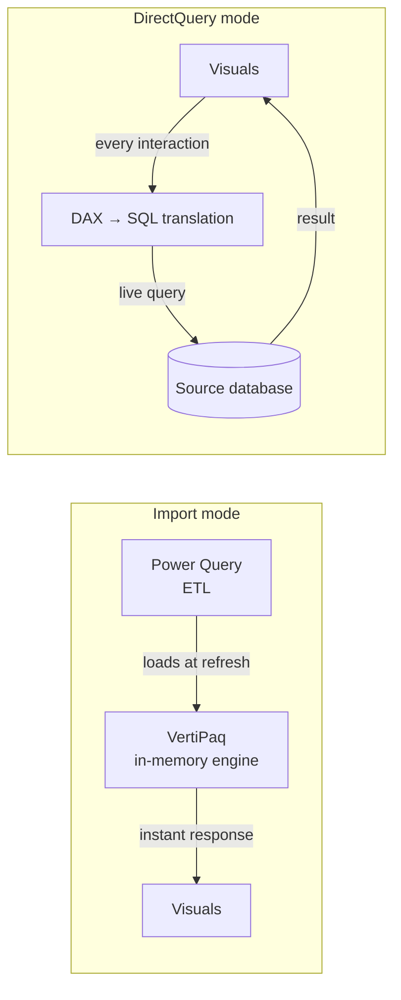

# Import vs DirectQuery

## ELI5

**Import mode** is like printing out the database and working from the printout. It is fast because everything is already on your desk, but it goes stale — you need to reprint (refresh) to see new data.

**DirectQuery mode** is like keeping a live phone line open to the database. Every time you ask a question, it calls the database in real time. The data is always fresh, but every question requires a phone call — and if the database is slow or busy, you wait.

Most models should start with Import. Move to DirectQuery only when data freshness requirements or data volume make Import impractical.

## Visual

## How it works in practice

| Dimension | Import | DirectQuery |
|---|---|---|
| Data freshness | As of last refresh (scheduled or manual) | Real-time (seconds old) |
| Query speed | Very fast — in-memory VertiPaq | Depends on source DB performance |
| Data volume | Limited by RAM / capacity | Effectively unlimited |
| DAX support | Full DAX | Some DAX functions unavailable |
| Power Query transformations | Full support | Limited — only foldable steps |
| Row-level security | Supported | Supported |
| Composite models | Mix Import + DirectQuery tables | Yes (the DirectQuery side) |

**When to use Import:**
- Tables under ~1 billion rows
- Data refreshes are acceptable every 30 minutes or less
- Complex DAX measures are required
- Source database cannot handle the query load of a live connection

**When to use DirectQuery:**
- Data must be current to the minute or second
- Tables are too large to import (hundreds of millions to billions of rows)
- Organizational governance requires data never leave the source system
- Source is a real-time streaming database

### Key facts

- [ ] Import mode stores a compressed copy of your data in VertiPaq — it is **not** connected to the source at query time
- [ ] DirectQuery sends a **SQL (or equivalent) query** to the source for every visual render — the source must be capable of handling this load
- [ ] Some DAX functions (`EARLIER`, certain time intelligence functions) are **not supported** in DirectQuery mode
- [ ] Power Query transformations that cannot be "folded" into source SQL are **not supported** in DirectQuery
- [ ] Import models can refresh up to **48 times per day** on Power BI Premium
- [ ] A single model can mix both modes using **composite models** — dimension tables in Import, large fact tables in DirectQuery
- [ ] Always test DirectQuery performance with the expected concurrent user count before publishing to production
