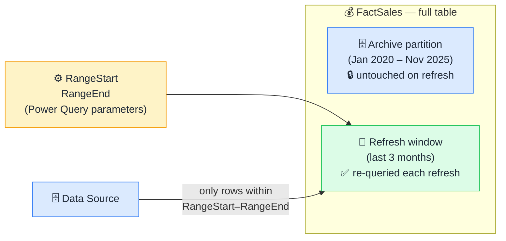

# 🔄 Incremental Refresh

> **🧒 Explain Like I'm 5:** Refresh only the new rows — historical data stays untouched.

## 🖼️ The Picture

The archive stays frozen. Only the refresh window moves forward with each refresh cycle.

## 🔧 How it actually works

**Incremental refresh** splits your fact table into partitions. Everything older than your defined cutoff (say, 3 months) is frozen in the **archive partition** — it was loaded once and never touched again. The **refresh window** covers only recent data (the last 3 months, or whatever you configure) and is re-queried on every refresh cycle.

The 500-page report analogy: if you only added one new page to a report, you wouldn't reprint all 500 pages every morning — you'd just print the new page. Incremental refresh is the same idea applied to your Power BI dataset. Historical years stay exactly as they were. Only the period where new or changing data could appear gets re-loaded.

Setting it up requires two Power Query parameters named exactly `RangeStart` and `RangeEnd` (the names are mandatory — Power BI looks for them specifically). You apply those parameters as a filter on your date column in Power Query. Then in the incremental refresh policy settings, you define how far back the archive extends and how wide the refresh window is. Power BI handles the rest: partitioning the table, freezing the archive, and updating only the refresh window. The crucial prerequisite: your Power Query must [fold](query-folding.md) the `RangeStart`/`RangeEnd` filter back to the source — if it doesn't fold, the source has to send all rows and the whole point of incremental refresh is lost.

## 🌍 Real-world example

A retail dataset with 6 years of daily transactions (roughly 800M rows) had a full refresh that took 4 hours and was regularly failing due to gateway timeout. After enabling incremental refresh with a 3-month refresh window and a 6-year archive, the daily refresh dropped to 8 minutes. The archive partitions loaded once during initial setup and have been untouched ever since.

## 🔗 Related

- [Query Folding](query-folding.md)
- [Import vs DirectQuery](import-vs-directquery.md)
- [Column Cardinality](column-cardinality.md)
