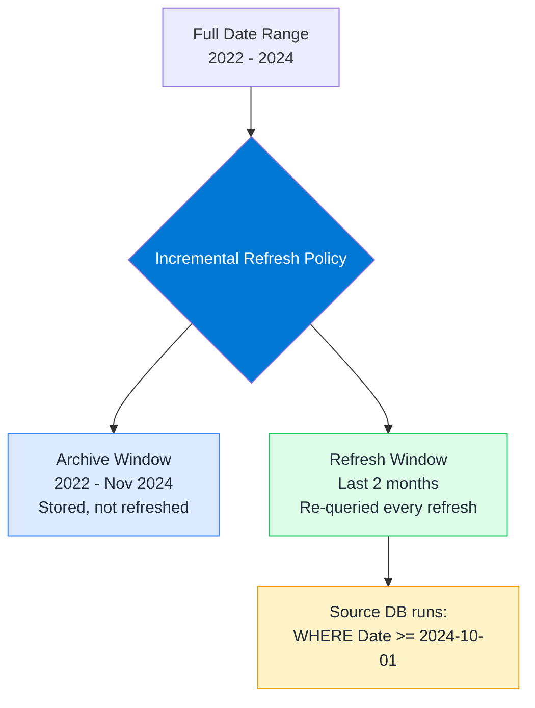

# Incremental Refresh

## ELI5

Imagine your report pulls 3 years of sales data. Every morning it refreshes. Without incremental refresh: it re-downloads and re-processes all 3 years every single time. With incremental refresh: it only downloads yesterday's new data. The old data is already there — untouched.

## Visual



## How it works in practice

**Requirements:**
1. Power BI Premium, Premium Per User, or Fabric capacity (not Pro)
2. Query folding must work on the date/time column used for the policy
3. The table must have a date or datetime column to partition on

**Setup steps:**
1. In Power Query, create two parameters: `RangeStart` (DateTime) and `RangeEnd` (DateTime)
2. Filter your date column: `>= RangeStart AND < RangeEnd`
3. Power BI replaces these at refresh time with the actual window boundaries
4. In the dataset settings, define: Archive = 3 years, Refresh = 2 months

```powerquery
// Power Query filter — must use these exact parameter names
= Table.SelectRows(Source, each [OrderDate] >= RangeStart and [OrderDate] < RangeEnd)
```

**What happens at refresh:**
- Power BI partitions the table by period (month or day)
- Archive partitions are kept as-is
- Only refresh-window partitions are re-queried
- New data lands in the latest partition

**Key facts:**
- If query folding breaks, the entire date range is pulled — no error, just silent full-refresh behavior
- `Detect data changes` option lets you skip refreshing a partition if a "last updated" column hasn't changed — major performance win for append-only tables
- Historical partitions can be set to `Import` while the refresh window uses `DirectQuery` (hybrid mode)
- After publishing, incremental refresh policy cannot be changed without re-publishing the full dataset
- Use `XMLA endpoint` (Premium feature) to inspect and manage partitions directly
