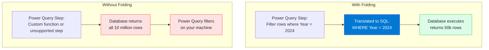

# Query Folding

## ELI5

Imagine you ordered a custom pizza from a restaurant. Option A: you call the restaurant and say "make me a pepperoni pizza" — they make it fresh in their professional kitchen. Option B: they send you all their raw ingredients, and you make the pizza yourself on your tiny home stove.

Query folding is Option A. Power Query sends your transformation instructions back to the data source (SQL server, REST API, etc.) and lets it do the heavy work on its own hardware. Without folding, Power Query downloads everything and processes it on your machine.

## Visual



## How it works in practice

Every Power Query step that can be translated into the source query language (SQL, OData, etc.) folds back to the source. The moment a step cannot be translated — a custom function, a type change the connector doesn't support, merging with a non-foldable source — folding **breaks** for all steps after it.

**Check if a step folds:** right-click any step in Power Query Editor → if "View Native Query" is available and not greyed out, that step folds.

**Common steps that break folding:**
- `Table.AddColumn` with custom logic (M code functions)
- `Table.Buffer`
- `Table.Combine` across different sources
- Certain type conversions on non-SQL sources

**How to preserve folding:**
```
-- Good: filter early, before any non-foldable steps
Source → Filter Rows → Remove Columns → ...non-foldable step...

-- Bad: filter after a non-foldable step (filter won't fold)
Source → ...non-foldable step... → Filter Rows
```

**Key facts:**
- Query folding only works on sources that support it (SQL Server, PostgreSQL, Oracle, SharePoint, OData — yes; Excel, CSV, web scraping — no)
- Incremental refresh **requires** query folding — if folding breaks, incremental refresh silently falls back to full refresh
- `Table.Buffer()` deliberately breaks folding — only use it when you need a snapshot to avoid re-evaluation
- Moving filter and remove-columns steps above any non-foldable step is the single biggest quick win for refresh performance
