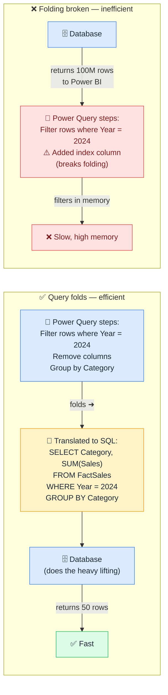

# 🪗 Query Folding

> **🧒 Explain Like I'm 5:** Power Query pushes your transformation steps back to the database — so it only downloads the rows you need.

## 🖼️ The Picture

When folding works, the database does the filtering. When folding breaks, Power BI downloads everything first.

## 🔧 How it actually works

When you apply steps in Power Query — filter rows, remove columns, aggregate — Power BI tries to translate those steps into the native query language of the source (SQL for relational databases, OData for web APIs, etc.). This translation is **query folding**. When it works, the source system handles the transformation and returns only the processed result. When it doesn't work (folding breaks), Power BI downloads the entire raw table and applies the transformations in memory locally.

The pizza analogy: ordering a custom pizza (folding) means the restaurant makes exactly what you want and hands you one finished pizza. Having all the ingredients delivered to your house (no folding) means you do all the work yourself — you receive 100 ingredients and have to assemble and cook. Both produce the same pizza. One is vastly more work and uses more of your kitchen.

Certain Power Query steps break folding: adding an index column, using a custom function, calling `Table.Buffer()`, performing steps that the source query language can't express. The tricky part is that once folding breaks, every subsequent step in the query is also unfolded — even simple filters that would have folded fine on their own. The rule of thumb: put steps that can fold (filter rows, remove columns, rename columns) early in your query, and put steps that might break folding (custom functions, added indexes) as late as possible. You can check whether a step folds by right-clicking it in Power Query and looking for "View Native Query" — if that option is available, the step folds; if it's greyed out, it doesn't.

## 🌍 Real-world example

A Power Query that loaded 10 years of sales data (400M rows) and then filtered to the current year was taking 12 minutes to refresh because the filter came after an unfolded merge step — so all 400M rows were pulled into memory first. Moving the year filter to the very first step (before the merge) allowed it to fold, cutting refresh time to 45 seconds.

## 🔗 Related

- [Incremental Refresh](incremental-refresh.md)
- [Import vs DirectQuery](import-vs-directquery.md)
- [Snowflake Schema](snowflake-schema.md)
