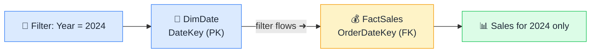

# 🔗 Relationships

> **🧒 Explain Like I'm 5:** The invisible bridge that lets filters in one table cross over to another.

## 🖼️ The Picture

A filter applied to DimDate automatically narrows down the rows returned from FactSales.

## 🔧 How it actually works

A relationship in Power BI is a connection between a column in one table and a matching column in another — typically the primary key of a dimension table linked to a foreign key in the fact table. When you click "Manage Relationships" or drag a column onto another in Model view, you're telling Power BI: "these two columns share the same values — use that to pass filters between them."

The analogy that sticks: imagine a UN meeting where every delegation speaks a different language. A relationship is the translator sitting between two delegations. Without one, filters applied to DimProduct stay inside DimProduct and never reach FactSales. With one, a slicer on "Product Category" immediately narrows which sales rows are visible.

Relationships in a star schema flow in one direction by default: from the dimension table (the "one" side) to the fact table (the "many" side). This means filters from dimensions propagate into facts — which is exactly what you want. Reversing that direction, or making it bidirectional, can cause unexpected results. Keep it one-way unless you have a specific reason not to.

## 🌍 Real-world example

In a sales report, you select "Q3" on a date slicer. Power BI filters DimDate to the rows where Quarter = "Q3", then follows the relationship into FactSales to return only the sales rows whose OrderDateKey matches those dates. The chart updates instantly — all because of one relationship line in the model.

## 🔗 Related

- [Cardinality](cardinality.md)
- [Cross-Filter Direction](cross-filter-direction.md)
- [Active vs Inactive Relationships](active-inactive-relationships.md)
- [Star Schema](star-schema.md)
