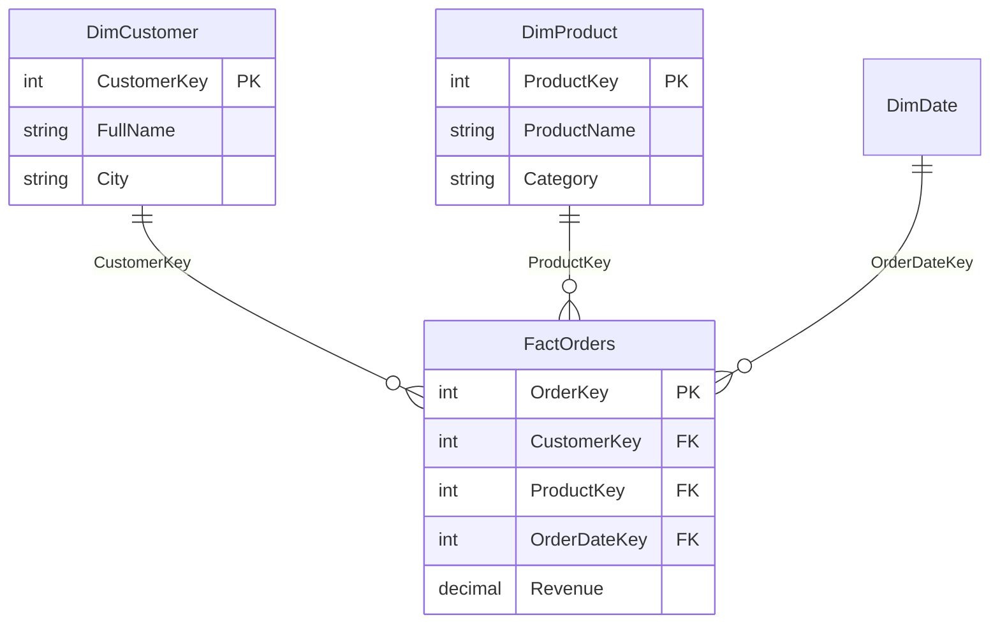

# Relationships

## ELI5

Imagine two spreadsheets. One lists every order ever placed; the other lists every customer. Each order row has a customer ID number. When you draw a line connecting "customer ID in the orders sheet" to "customer ID in the customers sheet," you have created a **relationship**.

Power BI uses that line to answer questions like "show me total sales grouped by customer city" — even though the city column lives in the customer sheet and the sales column lives in the orders sheet. The relationship is the bridge between them.

## Visual

## How it works in practice

A report page has a slicer for `DimCustomer[City]` and a card showing `SUM(FactOrders[Revenue])`. When a user selects "Paris," Power BI:

1. Finds all `CustomerKey` values in `DimCustomer` where `City = "Paris"`
2. Traverses the relationship to `FactOrders`
3. Filters `FactOrders` to only those matching customer keys
4. Evaluates `SUM(Revenue)` on the filtered rows

No relationship = no filter propagation = wrong (unfiltered) numbers.

### Key facts

- [ ] A relationship requires **one side** with unique values (the "one" side) and a **many side** (the fact table)
- [ ] The join columns on both sides must be the **same data type**
- [ ] A model can have multiple relationships between the same two tables, but only **one can be active** at a time
- [ ] Inactive relationships can still be used in DAX with `USERELATIONSHIP()`
- [ ] Relationships defined in the model automatically apply to **all visuals on all pages** — no manual joins needed
- [ ] A missing or broken relationship is the most common cause of "all values show the same total" bugs
