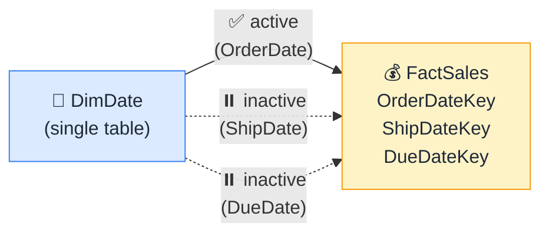

# 🎭 Role-Playing Dimensions

> **🧒 Explain Like I'm 5:** One date table playing three characters: Order Date, Ship Date, and Due Date.

## 🖼️ The Picture

One actor, three roles — each relationship gives the same table a different character in the story.

## 🔧 How it actually works

A **role-playing dimension** is one dimension table that serves multiple purposes in the same fact table. The classic example is dates: a sales transaction has an order date, a ship date, and a due date. All three are dates, so all three should look up into the same DimDate table. Instead of duplicating DimDate three times, you create three relationships — one per date column — and activate only the one that represents the default date context (usually OrderDate).

The inactive relationships don't disappear — they're available for DAX measures using `USERELATIONSHIP()`. A measure like `Shipped Sales` can be written to filter by ShipDate while every default visual filters by OrderDate. One table, three distinct behaviors, zero duplication.

Some modelers do create duplicate date tables (e.g., DimOrderDate, DimShipDate, DimDueDate) for simplicity — especially when each date column needs a different set of visible columns in the field list. That approach works fine but costs memory. The single-table-with-inactive-relationships approach is leaner; the tradeoff is that inactive relationships require explicit DAX to activate. Pick the approach that fits your team's DAX comfort level.

## 🌍 Real-world example

A manufacturing dashboard shows "On-Time Delivery %" — the ratio of orders where ShipDate was on or before DueDate. The measure uses `USERELATIONSHIP` twice in the same calculation, once to access ShipDate values and once for DueDate values, all from the same DimDate table. Without role-playing dimensions, this would require either two separate date tables or a much messier calculated column approach.

## 🔗 Related

- [Active vs Inactive Relationships](active-inactive-relationships.md)
- [Date Table Requirements](date-table-requirements.md)
- [Relationships](relationships.md)
