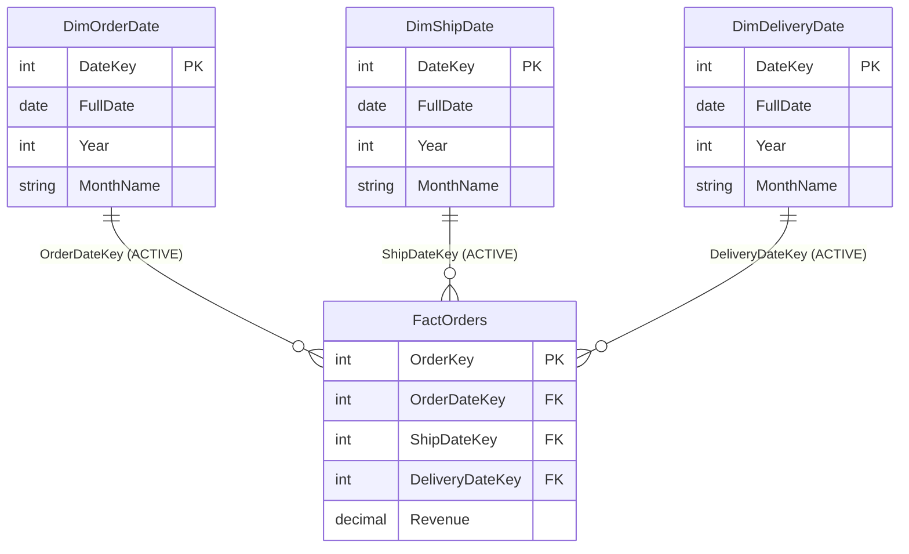

# Role-Playing Dimensions

## ELI5

Think of an actor who plays three different characters in the same movie — the same person, three different roles. A role-playing dimension is the same idea: **one dimension table** (usually `DimDate`) that gets used multiple times in the same fact table, each time in a different role (order date, ship date, delivery date).

Because Power BI only allows one active relationship between two tables at a time, you have two options: use inactive relationships with `USERELATIONSHIP()`, or make physical copies of the dimension — one copy per role — each with its own active relationship.

## Visual



> Each `Dim*Date` table is a copy of the same underlying date dimension, each with its own active relationship.

## How it works in practice

**Approach 1 — Physical copies (calculated tables or Power Query duplicates):**

Create separate dimension tables using a calculated table in DAX:

```dax
DimShipDate = DimDate
DimDeliveryDate = DimDate
```

Each copy gets its own active relationship. Slicers on `DimShipDate[MonthName]` filter `FactOrders` via the ship date path, with no DAX gymnastics needed.

**Approach 2 — One table with inactive relationships:**

Keep a single `DimDate` with one active relationship and use `USERELATIONSHIP()` in measures for the other roles. Simpler model graph, but every "ship date" or "delivery date" measure must explicitly call `USERELATIONSHIP()`.

**When to use which:**

| Situation | Recommended approach |
|---|---|
| Few date roles, mostly measure-level analysis | Single table + `USERELATIONSHIP()` |
| Report pages dedicated to each date role | Physical copies — simpler slicer/filter setup |
| Report users drag columns directly (no measures) | Physical copies — inactive relationships won't help |

### Key facts

- [ ] Role-playing dimensions most commonly occur with `DimDate` but apply to any dimension reused in multiple contexts
- [ ] Physical copies increase model size but make the report canvas behavior simpler and more intuitive
- [ ] `USERELATIONSHIP()` adds friction — every developer touching those measures must know to include it
- [ ] Calculated table copies (`DimShipDate = DimDate`) share the same source data — they stay in sync automatically
- [ ] Prefix the copy table names clearly: `DimOrderDate`, `DimShipDate`, `DimDeliveryDate`
- [ ] In the report view, hide duplicate tables from the field list if users should only interact with measures, not raw columns
