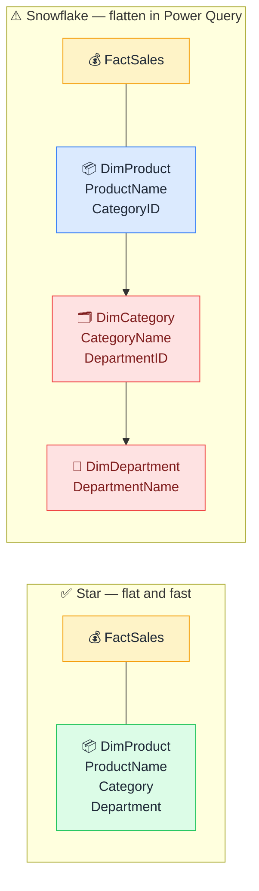

# ❄️ Snowflake Schema

> **🧒 Explain Like I'm 5:** A star schema where dimension tables branch further into sub-dimensions — usually a trap in Power BI.

## 🖼️ The Picture

Flatten the sub-dimension tables into one in Power Query before they reach the model.

## 🔧 How it actually works

A **snowflake schema** is what happens when dimension tables are normalized — split into sub-tables to reduce redundancy. Instead of DimProduct containing Category and Department as columns, Category lives in its own DimCategory table, and Department lives in its own DimDepartment table. This is great database design for transactional systems (OLTP), but it's the wrong shape for Power BI's in-memory engine (VertiPaq).

The address book analogy: instead of one card per person with their city and country written on it, you have a card that points to a city card that points to a country card. In theory it's tidier — update one city card and everything that references it gets updated. In practice, every time you want someone's country you have to follow two links. More joins, more complexity, more places for things to go wrong.

Power BI can handle snowflake schemas — it just doesn't thrive on them. Every extra relationship is extra join overhead at query time. Every extra table clutters the model view and the field list. The recommended fix is to merge the sub-dimension tables back into a flat dimension in **Power Query** before they reach the model. You get the normalized source (and its update advantages) at the database level, while Power BI gets the flat star schema it performs best with.

## 🌍 Real-world example

A data warehouse exports DimProduct, DimCategory, and DimDepartment as separate tables. In Power Query, you use a merge step to pull CategoryName and DepartmentName directly into DimProduct, then disable loading DimCategory and DimDepartment. The model sees one flat DimProduct table. The warehouse stays normalized. Everyone wins.

## 🔗 Related

- [Star Schema](star-schema.md)
- [Fact vs Dimension Tables](fact-vs-dimension.md)
- [Query Folding](query-folding.md)
