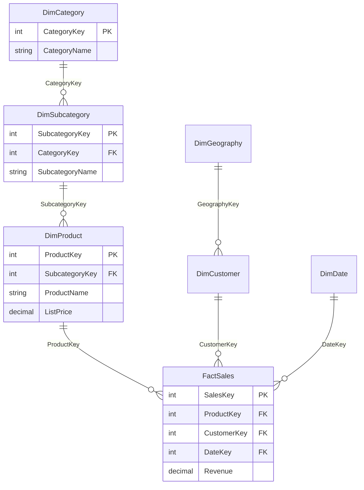

# Snowflake Schema

## ELI5

A star schema has one dimension table per concept (Product, Customer, Date). A **snowflake schema** takes those dimension tables and splits them further into sub-tables.

Instead of one `DimProduct` that contains both the product name and the category name, you have `DimProduct` pointing to a separate `DimCategory` table. It looks like a snowflake — the star's points branch out again.

The trade-off: your source database analysts love it because it eliminates data redundancy. Your Power BI model does not love it because every extra join is an extra hop that can slow down queries and complicate DAX.

## Visual



## How it works in practice

A data warehouse team delivers a snowflake schema from their SQL database. The modeler has two options:

**Option 1 — Flatten in Power Query (recommended for Power BI):**
Merge `DimProduct`, `DimSubcategory`, and `DimCategory` into a single denormalized `DimProduct` table. The result is a clean star schema. VertiPaq compresses the repeated category names efficiently, so the storage cost is negligible.

```
// Power Query: merge subcategory into product, then merge category
DimProduct
  → Merge with DimSubcategory on SubcategoryKey
  → Merge with DimCategory on CategoryKey
  → Remove FK columns, keep name columns
```

**Option 2 — Keep the snowflake, accept the trade-offs:**
Retain all three tables with their relationships. DAX context flows through the chain (`DimCategory` → `DimSubcategory` → `DimProduct` → `FactSales`), but every extra hop is a potential performance cost and makes DAX like `RELATED()` chains more complex.

### Key facts

- [ ] Snowflake schemas come from normalized databases designed for OLTP — they are **not optimized for analytical queries**
- [ ] Power BI performs best with a **flattened star schema** — flatten snowflake dimensions in Power Query before loading
- [ ] VertiPaq compresses repeated string values extremely well — the "wasted space" argument for normalization does not apply
- [ ] If you must keep the snowflake, ensure filter propagation flows **toward** the fact table (not away)
- [ ] Deep chains (4+ hops from a dimension to the fact) are a model design warning sign
- [ ] Use Power Query's **Merge Queries** to flatten, not calculated columns — transformations before load are faster and keep the model cleaner
