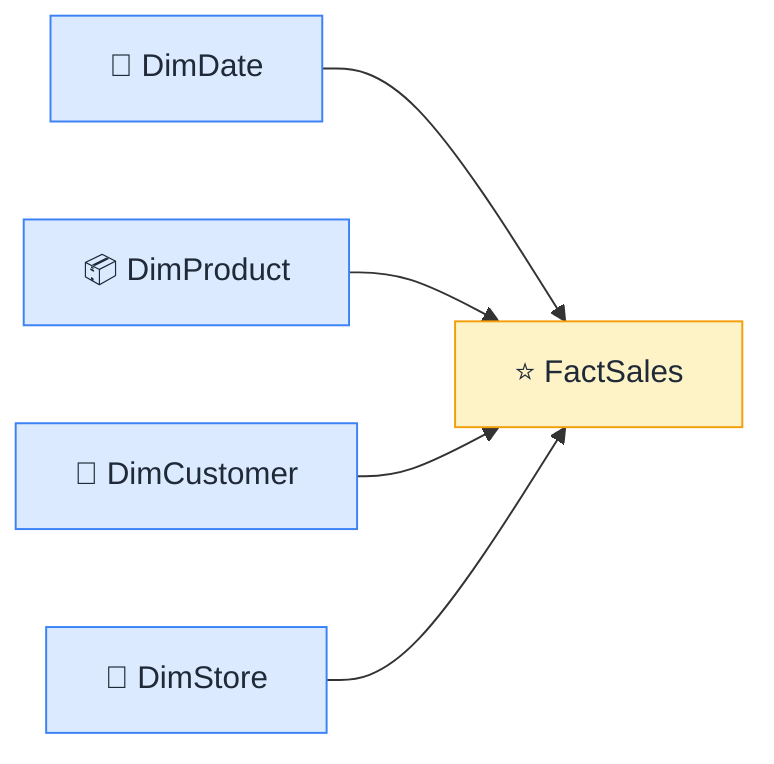

# ⭐ Star Schema

> **🧒 Explain Like I'm 5:** One fact table in the middle, dimension tables around it — the shape that makes Power BI fast.

## 🖼️ The Picture

Draw lines from the surrounding tables to the center and it looks like a star.

## 🔧 How it actually works

Think of a pizza order form. The order itself — the price, quantity, date, and store ID — is the **fact**. The customer who ordered, the store it came from, the pizza on the menu, the promo applied: those are the **dimensions**. The fact table sits in the center and holds the numbers. The dimension tables sit around it and hold the descriptions.

In Power BI, relationships flow from each dimension table into the fact table. When you drop "Product Category" from DimProduct onto a chart, the filter travels through the relationship into FactSales and returns only the matching rows. This one-directional flow is predictable, fast, and easy for the engine to optimize.

The star schema is the starting point for almost everything in this repo. If your model isn't shaped like a star, most of the performance and DAX advice you'll read online won't apply cleanly. Get this shape right first, and everything else gets easier.

## 🌍 Real-world example

Every Power BI sample dataset Microsoft ships — AdventureWorks, Contoso, Northwind — uses a star schema. Open any one of them in Power BI Desktop, click the Model view, and you'll immediately see the fact table in the middle with dimension tables radiating outward.

## 🔗 Related

- [Fact vs Dimension Tables](fact-vs-dimension.md)
- [Relationships](relationships.md)
- [Snowflake Schema](snowflake-schema.md)
