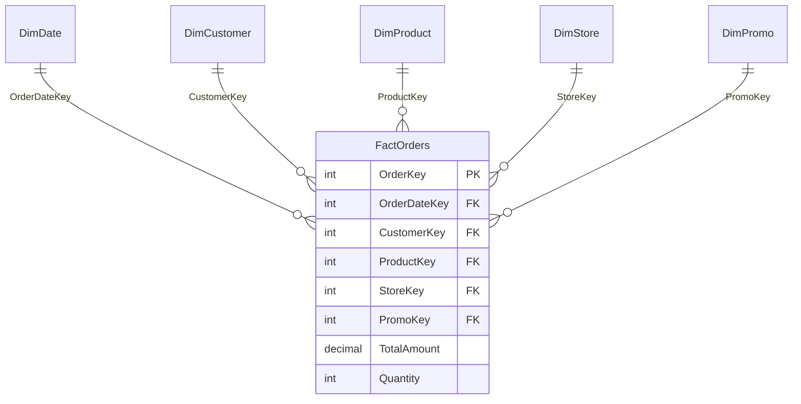

# Star Schema

## ELI5

Imagine a pizza order form. In the center is the order itself — how many pizzas, total price, date ordered. Around it are the details: which customer ordered, which store fulfilled it, which pizza they chose, which promo code they used.

The order is your **fact table** — it holds numbers and foreign keys. The customer, store, pizza, and promo are your **dimension tables** — they hold the descriptive details you filter and group by.

Draw lines from each dimension to the fact table and it looks like a star. That's it.

## Visual



## Why Power BI loves star schemas

Power BI's engine (VertiPaq) is built around this pattern. When your model is a star:
- Filters flow **one direction** — from dimension to fact
- DAX context is predictable
- Compression is maximum (dimensions are small, facts are big and repetitive = compress well)
- Relationships are always one-to-many, avoiding ambiguity

## What to avoid

```mermaid
graph TD
    subgraph Bad — Flat table
        F[OneGiantTable\nCustomerName + StoreName + ProductName + Amount + Date...]
    end
    subgraph Good — Star schema
        Dim1[DimCustomer] --> Fact[FactSales]
        Dim2[DimStore] --> Fact
        Dim3[DimProduct] --> Fact
        Dim4[DimDate] --> Fact
    end
```

A flat table feels simpler but kills performance and makes DAX write like a headache. Split it into a star and both problems go away.

## Checklist

- [ ] Fact table contains only numbers and foreign keys — no descriptive text columns
- [ ] Dimension tables contain only one primary key column (no duplicates)
- [ ] Every relationship is one-to-many (dimension → fact)
- [ ] Date table exists as a separate dimension and is marked as a date table
